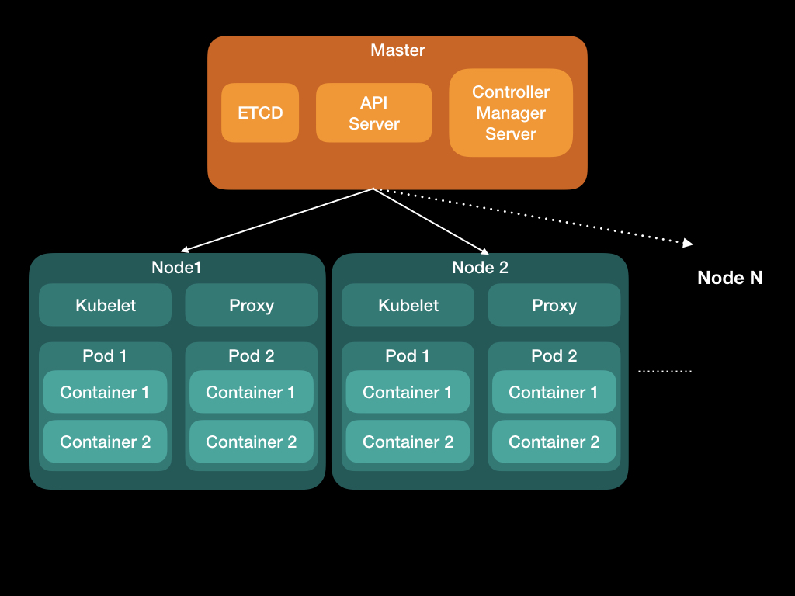

# [Day1] 挑戰開始：k8s初探＋簡介

Author: Nick Zhuang
Type: kubernetes

# 前言

去年夏天，因為公司面臨轉型的新需求，我們因此要使用到Docker，相較於以往的虛擬機，它具有啟動速度上的優勢，因為我們的服務需要做到跨平台，且需要針對相依的服務作管理，因緣際會之下，開啟了Docker與k8s的學習之路。

# 什麼是Kubernetes？

Kubernetes這個名字源於希臘語，意思是舵手或飛行員。

一般簡稱**k8s**~~或g8s~~，為求表達方便，後需皆以此代稱。

k8s是一個可移植，可擴展的開源平台，用於管理容器化工作負載和服務。

k8s是針對Docker環境所設計的管理框架，類似的框架還有Docker Swarm和Mesos，也有類似Docker的原始碼專案，如：[rkt](https://coreos.com/rkt/docs/latest/rkt-vs-other-projects.html)

# 為什麼要用Kubernetes？

在生產環境中，若需要管理運行應用程序的容器並確保沒有停機時間。例如，如果容器發生故障，則需要啟動另一個容器。如果有系統能自動幫我們協調處理這些事情就很方便。

k8s提供了一個彈性運行分佈式系統的框架。它可以負責的擴展要求，故障轉移，部署模式等。如此一來，能讓開發者專注在提供的服務上。

### k8s提供了一些功能：

- **服務發現和負載平衡**

    k8s可以使用DNS名稱或使用自己的IP地址公開容器。如果容器的流量很高，k8s能夠負載均衡並分配網絡流量，以便部署穩定。

- **存儲編排**

    k8s允許您自動掛載選擇的存儲系統，例如本地存儲，公共雲提供商等。

- **自動部署和回滾**

    可以使用k8s描述已部署容器的所需狀態，並且可以以受控速率將實際狀態更改為所需狀態。例如，可以自動化k8s為部署創建新容器，刪除現有容器並將所有資源用於新容器。

- **自動調度**

    k8s允許指定每個容器需要多少CPU和內存（RAM）。當容器指定了資源請求時，k8s可以更好地決定管理容器的資源。

- **自我修復**

    k8s重新啟動失敗的容器，替換容器，殺死不回應用戶定義的運行狀況檢查的容器，並且在它們準備好服務之前不會將它們通告給客戶端。

- **密鑰和配置管理**

    k8s允許存儲和管理敏感信息，例如密碼、ssh密鑰。可以部署和更新機密和應用程序配置，而無需重建容器映像，也不會在配置中暴露機密。

# K**ubernetes架構與使用**

首先，若要架設k8s的話，必須要在server上設定master node，至少要有一個master node

基本上，所有在k8s的node，分為master和non-master兩種，為求簡化，將non-master定義為slave，後續提到相關node皆以slave稱之

1. Master node : 分為三個部分：kube-apiserver、 kube-controller-manager、kube-scheduler
2. Slave node : 分為兩個部分：kubelet、kube-proxy

# Kubernetes中有哪些Component？

基本的Object有四種，分別為Pod、Service、Volume、Namespace

高階的abstraction有五種，可用來控管基本的Object，稱為Controller，分別為ReplicaSet、Deployment、StatefulSet、DaemonSet、Job

# 小結

從上述一些內容可以知道，k8s存在的目的是為了有效率的管理容器，而這容器裝載了我們所開發的服務甚至是程序，這樣一來可以讓開發人員更專注在這件事上面，當然如何使用k8s就是門學問了，請先著重在架構上理解及其目的，細節後續會陸續加進來。

# 參考連結

- [k8s的觀念](https://kubernetes.io/docs/concepts/)
- [k8s的設計與架構](https://github.com/kubernetes/community/blob/master/contributors/design-proposals/architecture/architecture.md)
- [k8s的發展藍圖](https://github.com/kubernetes/community/blob/master/contributors/design-proposals/architecture/architectural-roadmap.md)
- [什麼是k8s？](https://kubernetes.io/docs/concepts/overview/what-is-kubernetes/)

