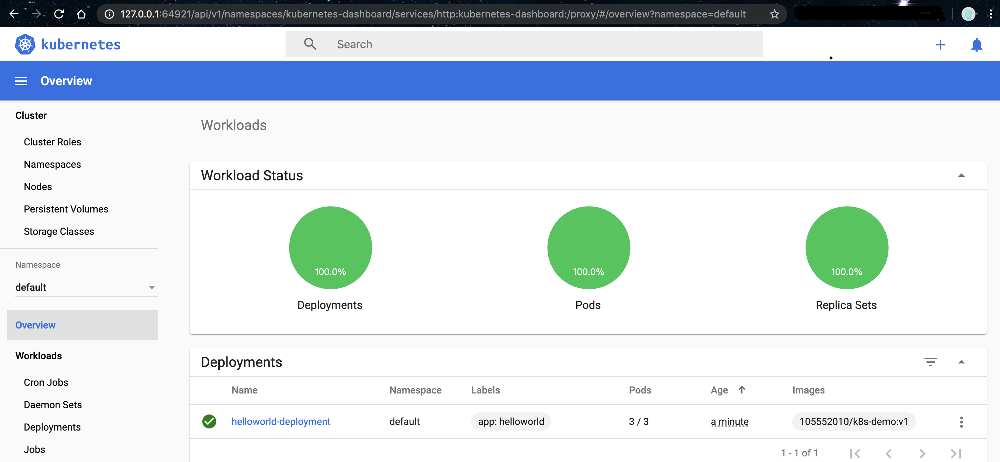
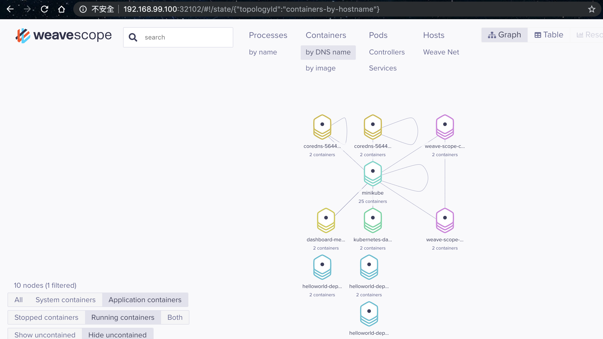
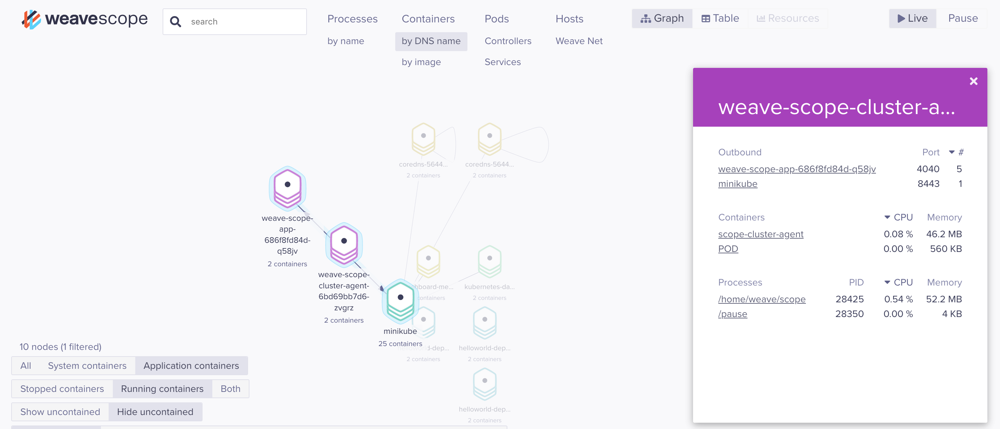

# 第十四天：k8s之七：管理篇之一，Monitoring、Job、CronJob

Author: Nick Zhuang
Type: kubernetes

# 前言

今天是管理篇的第一篇，從今天的內容開始，我們會從集群中的功能使用轉換到管理集群的部分，直到目前為止，還有些元件沒有介紹完畢，主要是因為有些元件是歸類到管理篇的。

首先，第一個部分是monitoring，監控的部分，在舊版的k8s中，通常會提到heapster這個套件，這個套件可以搭配influxDB和Grafana來監控集群，並且，也可以透過安裝heapster的機制，藉以實作HPA（Horizontal Pod AutoScaler，這是Scaling的延伸內容）。但是，隨著時間的推移，目前heapster這個項目已經放到了k8s retired的部分（deprecated），這就意味著，後面的k8s版本將不會支援這個套件，所以這裡並不是要介紹這個東西，而是要介紹新寵兒：weave scope，這個套件它是相容k8s的，即使純Docker環境一樣也可以用，我們可以透過weave scope這個套件達到監控集群的效果。

再來的剩下兩個部分，Job及CronJob是一組的，他們是k8s中的Abstraction，主要定義了批次執行的概念，Job會保證在它所定義的Pod中執行對應指令一定會完成，而CronJob是類似排程的概念，我們可以透過CronJob把Job中所定義的工作放到排程中。

# Monitoring

我們來看一下weave scope這套件要如何安裝到集群上

## 前置準備

檢查集群狀態

    $kubectl get componentstatuses
    NAME                 STATUS    MESSAGE             ERROR
    controller-manager   Healthy   ok
    scheduler            Healthy   ok
    etcd-0               Healthy   {"health":"true"}
    $kubectl get nodes
    NAME       STATUS   ROLES    AGE     VERSION
    minikube   Ready    master   3d19h   v1.16.0

檢查Namespace

    $kubectl get namespaces
    NAME                   STATUS   AGE
    default                Active   3d19h
    kube-node-lease        Active   3d19h
    kube-public            Active   3d19h
    kube-system            Active   3d19h

探索Docker的Image和Container

    $eval $(minikube docker-env)

新增一個Deployment，測試用

    $vim pod-deploy.yaml
    apiVersion: apps/v1
    kind: Deployment
    metadata:
      name: helloworld-deployment
      labels:
        app: helloworld
    spec:
      replicas: 3
      selector:
        matchLabels:
          app: helloworld
      template:
        metadata:
          labels:
            app: helloworld
        spec:
          containers:
          - name: k8s-demo
            image: 105552010/k8s-demo:v1
            ports:
            - containerPort: 3000

啟動Deployment

    $kubectl apply -f pod-deploy.yaml
    deployment.apps/helloworld-deployment created

開啟minikube的Dashboard

    $minikube dashboard --url &
    [1] 20847

檢查minikube的Dashboard

OK，代表集群擷取訊息正常。

接著我們新增一個scope.yaml（為了能支援新版，筆者有修改了一下

    $vim scope.yaml
    apiVersion: v1
    kind: List
    items:
      - apiVersion: v1
        kind: Namespace
        metadata:
          name: weave
          annotations:
            cloud.weave.works/version: v1.0.0-239-gadaf03b
      - apiVersion: v1
        kind: ServiceAccount
        metadata:
          name: weave-scope
          annotations:
            cloud.weave.works/launcher-info: |-
              {
                "original-request": {
                  "url": "/k8s/v1.8/scope.yaml",
                  "date": "Sat Sep 28 2019 13:31:07 GMT+0000 (UTC)"
                },
                "email-address": "support@weave.works"
              }
          labels:
            name: weave-scope
          namespace: weave
      - apiVersion: rbac.authorization.k8s.io/v1beta1
        kind: ClusterRole
        metadata:
          name: weave-scope
          annotations:
            cloud.weave.works/launcher-info: |-
              {
                "original-request": {
                  "url": "/k8s/v1.8/scope.yaml",
                  "date": "Sat Sep 28 2019 13:31:07 GMT+0000 (UTC)"
                },
                "email-address": "support@weave.works"
              }
          labels:
            name: weave-scope
        rules:
          - apiGroups:
              - ''
            resources:
              - pods
            verbs:
              - get
              - list
              - watch
              - delete
          - apiGroups:
              - ''
            resources:
              - pods/log
              - services
              - nodes
              - namespaces
              - persistentvolumes
              - persistentvolumeclaims
            verbs:
              - get
              - list
              - watch
          - apiGroups:
              - apps
            resources:
              - statefulsets
            verbs:
              - get
              - list
              - watch
          - apiGroups:
              - batch
            resources:
              - cronjobs
              - jobs
            verbs:
              - get
              - list
              - watch
          - apiGroups:
              - extensions
            resources:
              - deployments
              - daemonsets
            verbs:
              - get
              - list
              - watch
          - apiGroups:
              - extensions
            resources:
              - deployments/scale
            verbs:
              - get
              - update
          - apiGroups:
              - storage.k8s.io
            resources:
              - storageclasses
            verbs:
              - get
              - list
              - watch
          - apiGroups:
              - volumesnapshot.external-storage.k8s.io
            resources:
              - volumesnapshots
              - volumesnapshotdatas
            verbs:
              - list
              - watch
      - apiVersion: rbac.authorization.k8s.io/v1beta1
        kind: ClusterRoleBinding
        metadata:
          name: weave-scope
          annotations:
            cloud.weave.works/launcher-info: |-
              {
                "original-request": {
                  "url": "/k8s/v1.8/scope.yaml",
                  "date": "Sat Sep 28 2019 13:31:07 GMT+0000 (UTC)"
                },
                "email-address": "support@weave.works"
              }
          labels:
            name: weave-scope
        roleRef:
          kind: ClusterRole
          name: weave-scope
          apiGroup: rbac.authorization.k8s.io
        subjects:
          - kind: ServiceAccount
            name: weave-scope
            namespace: weave
      - apiVersion: apps/v1
        kind: Deployment
        metadata:
          name: weave-scope-app
          annotations:
            cloud.weave.works/launcher-info: |-
              {
                "original-request": {
                  "url": "/k8s/v1.8/scope.yaml",
                  "date": "Sat Sep 28 2019 13:31:07 GMT+0000 (UTC)"
                },
                "email-address": "support@weave.works"
              }
          labels:
            name: weave-scope-app
            app: weave-scope
            weave-cloud-component: scope
            weave-scope-component: app
          namespace: weave
        spec:
          replicas: 1
          selector:
            matchLabels:
              name: weave-scope-app
              app: weave-scope
              weave-cloud-component: scope
              weave-scope-component: app
          revisionHistoryLimit: 2
          template:
            metadata:
              labels:
                name: weave-scope-app
                app: weave-scope
                weave-cloud-component: scope
                weave-scope-component: app
            spec:
              containers:
                - name: app
                  args:
                    - '--mode=app'
                  command:
                    - /home/weave/scope
                  env: []
                  image: 'docker.io/weaveworks/scope:1.11.6'
                  imagePullPolicy: IfNotPresent
                  ports:
                    - containerPort: 4040
                      protocol: TCP
      - apiVersion: v1
        kind: Service
        metadata:
          name: weave-scope-app
          annotations:
            cloud.weave.works/launcher-info: |-
              {
                "original-request": {
                  "url": "/k8s/v1.8/scope.yaml",
                  "date": "Sat Sep 28 2019 13:31:07 GMT+0000 (UTC)"
                },
                "email-address": "support@weave.works"
              }
          labels:
            name: weave-scope-app
            app: weave-scope
            weave-cloud-component: scope
            weave-scope-component: app
          namespace: weave
        spec:
          ports:
            - name: app
              port: 80
              protocol: TCP
              targetPort: 4040
          selector:
            name: weave-scope-app
            app: weave-scope
            weave-cloud-component: scope
            weave-scope-component: app
      - apiVersion: apps/v1
        kind: Deployment
        metadata:
          name: weave-scope-cluster-agent
          annotations:
            cloud.weave.works/launcher-info: |-
              {
                "original-request": {
                  "url": "/k8s/v1.8/scope.yaml",
                  "date": "Sat Sep 28 2019 13:31:07 GMT+0000 (UTC)"
                },
                "email-address": "support@weave.works"
              }
          labels:
            name: weave-scope-cluster-agent
            app: weave-scope
            weave-cloud-component: scope
            weave-scope-component: cluster-agent
          namespace: weave
        spec:
          replicas: 1
          selector:
            matchLabels:
              name: weave-scope-cluster-agent
              app: weave-scope
              weave-cloud-component: scope
              weave-scope-component: cluster-agent
          revisionHistoryLimit: 2
          template:
            metadata:
              labels:
                name: weave-scope-cluster-agent
                app: weave-scope
                weave-cloud-component: scope
                weave-scope-component: cluster-agent
            spec:
              containers:
                - name: scope-cluster-agent
                  args:
                    - '--mode=probe'
                    - '--probe-only'
                    - '--probe.kubernetes.role=cluster'
                    - '--probe.http.listen=:4041'
                    - 'weave-scope-app.weave.svc.cluster.local:80'
                  command:
                    - /home/weave/scope
                  env: []
                  image: 'docker.io/weaveworks/scope:1.11.6'
                  imagePullPolicy: IfNotPresent
                  ports:
                    - containerPort: 4041
                      protocol: TCP
                  resources:
                    requests:
                      cpu: 100m
                      memory: 100Mi
              serviceAccountName: weave-scope
      - apiVersion: apps/v1
        kind: DaemonSet
        metadata:
          name: weave-scope-agent
          annotations:
            cloud.weave.works/launcher-info: |-
              {
                "original-request": {
                  "url": "/k8s/v1.8/scope.yaml",
                  "date": "Sat Sep 28 2019 13:31:07 GMT+0000 (UTC)"
                },
                "email-address": "support@weave.works"
              }
          labels:
            name: weave-scope-agent
            app: weave-scope
            weave-cloud-component: scope
            weave-scope-component: agent
          namespace: weave
        spec:
          minReadySeconds: 5
          selector:
            matchLabels:
              name: weave-scope-agent
              app: weave-scope
              weave-cloud-component: scope
              weave-scope-component: agent
          template:
            metadata:
              labels:
                name: weave-scope-agent
                app: weave-scope
                weave-cloud-component: scope
                weave-scope-component: agent
            spec:
              containers:
                - name: scope-agent
                  args:
                    - '--mode=probe'
                    - '--probe-only'
                    - '--probe.kubernetes.role=host'
                    - '--probe.docker.bridge=docker0'
                    - '--probe.docker=true'
                    - 'weave-scope-app.weave.svc.cluster.local:80'
                  command:
                    - /home/weave/scope
                  env: []
                  image: 'docker.io/weaveworks/scope:1.11.6'
                  imagePullPolicy: IfNotPresent
                  resources:
                    requests:
                      cpu: 100m
                      memory: 100Mi
                  securityContext:
                    privileged: true
                  volumeMounts:
                    - name: scope-plugins
                      mountPath: /var/run/scope/plugins
                    - name: sys-kernel-debug
                      mountPath: /sys/kernel/debug
                    - name: docker-socket
                      mountPath: /var/run/docker.sock
              dnsPolicy: ClusterFirstWithHostNet
              hostNetwork: true
              hostPID: true
              tolerations:
                - effect: NoSchedule
                  operator: Exists
              volumes:
                - name: scope-plugins
                  hostPath:
                    path: /var/run/scope/plugins
                - name: sys-kernel-debug
                  hostPath:
                    path: /sys/kernel/debug
                - name: docker-socket
                  hostPath:
                    path: /var/run/docker.sock
          updateStrategy:
            type: RollingUpdate

## 安裝Weave Scope

啟動這個YAML

    $kubectl apply -f scope.yaml

如果是用比較舊的k8s版本，可以直接下這個指令

    $kubectl apply -f 'https://cloud.weave.works/k8s/scope.yaml' -n weave

無論是哪種情況，命令列輸出都應該長類似這樣

    namespace/weave created
    serviceaccount/weave-scope created
    clusterrole.rbac.authorization.k8s.io/weave-scope created
    clusterrolebinding.rbac.authorization.k8s.io/weave-scope created
    deployment.apps/weave-scope-app created
    service/weave-scope-app created
    deployment.apps/weave-scope-cluster-agent created
    daemonset.apps/weave-scope-agent created

這樣就安裝完成囉！

檢查Weave Scope的Service設定

    $kubectl get svc -n weave
    NAME              TYPE        CLUSTER-IP      EXTERNAL-IP   PORT(S)   AGE
    weave-scope-app   ClusterIP   10.99.117.128   <none>        80/TCP    60s
    

修改Weave Scope的Service設定，將其中的type:ClusterIP改成NodePort

    $kubectl edit svc

改好後，再次檢查Weave Scope的Service設定

    $kubectl get svc -n weave
    NAME              TYPE       CLUSTER-IP      EXTERNAL-IP   PORT(S)        AGE
    weave-scope-app   NodePort   10.99.117.128   <none>        80:32102/TCP   109s

可以注意到有開port出來了，我們可以藉由這個port去access瀏覽器上Weave Scope的資訊

它這個套件有幾個有用的資訊：

- Container之間的連線狀態
- Pod之間的連線狀態
- Node之間的連線狀態

這些狀態是即時的，隨時監控，另外點開還可以看到每個服務對於硬體的負載訊息

其他一些比較細緻操作就自行嘗試囉！我們繼續介紹下個章節～

# Job

這個部分前面有稍微提過，我們再複習下：

Job創建一個或多個pod，並確保指定數量的Pod工作完成後終止。
刪除Job將清除它創建的Pod。
Job還可以用於並行運行多個Pod。

我們看個例子：

    $vim pod-job.yaml
    apiVersion: batch/v1
    kind: Job
    metadata:
      name: helloworld-job
    spec:
      ttlSecondsAfterFinished: 60
      template:
        metadata:
          labels:
            app: helloworld
        spec:
          containers:
          - name: k8s-demo
            image: 105552010/k8s-demo:v1
            command: ["echo", "helloworld"]
            ports:
            - containerPort: 3000
          restartPolicy: Never

這邊注意到有個`restartPolicy`，可以設成"Never"或"OnFailure"

還有就是`ttlSecondsAfterFinished`，這個是設定跑完後60秒後自動刪除Job，可以搭配CronJob使用

要啟用ttlSecondsAfterFinished這個設定，我們要先重啟minikube集群

    $minikube stop
    * Stopping "minikube" in virtualbox ...
    * "minikube" stopped.

啟動的時候要增加參數設置："TTLAfterFinished=true"

    $minikube start --feature-gates="TTLAfterFinished=true"
    * minikube v1.4.0 on Darwin 10.14.6
    * Tip: Use 'minikube start -p <name>' to create a new cluster, or 'minikube delete' to delete this one.
    * Starting existing virtualbox VM for "minikube" ...
    * Waiting for the host to be provisioned ...
    * Preparing Kubernetes v1.16.0 on Docker 18.09.9 ...
    * Relaunching Kubernetes using kubeadm ...
    * Waiting for: apiserver proxy etcd scheduler controller dns
    * Done! kubectl is now configured to use "minikube"

啟動Job

    $kubectl create -f pod-job.yaml
    job.batch/helloworld-job created

檢查Pod狀態

    $kubectl get po
    NAME                   READY   STATUS      RESTARTS   AGE
    helloworld-job-rldxw   0/1     Completed   0          6s
    $kubectl get po
    NAME                   READY   STATUS      RESTARTS   AGE
    helloworld-job-rldxw   0/1     Completed   0          33s
    $kubectl get po
    NAME                   READY   STATUS      RESTARTS   AGE
    helloworld-job-rldxw   0/1     Completed   0          59s
    $kubectl get po
    No resources found.
    $kubectl get job
    No resources found.

只是跑一個echo helloworld而已，一下就跑完了，60秒後系統就會自動把Pod和Job刪除，很方便吧？

# CronJob

這個部分是把前個所介紹的Job更加自動化，這個設置其實類似Linux系統中的CronJob，就是自動排程的概念。

它是基於時間管理的Job：

- 在給定時間點只運行一次
- 在給定時間點週期性地運行

我們看個例子：

新增一個CronJob的YAML

    $vim pod-cronJob.yaml
    apiVersion: batch/v1beta1
    kind: CronJob
    metadata:
      name: hello
    spec:
      schedule: "*/1 * * * *"
      jobTemplate:
        spec:
          template:
            spec:
              containers:
              - name: hello
                image: 105552010/k8s-demo:v1
                args:
                - /bin/sh
                - -c
                - date; echo Hello
              restartPolicy: OnFailure

以下說明這個檔案的設置：

第一個是schedule的部分

    # ┌───────────── minute (0 - 59)
    # │ ┌───────────── hour (0 - 23)
    # │ │ ┌───────────── day of the month (1 - 31)
    # │ │ │ ┌───────────── month (1 - 12)
    # │ │ │ │ ┌───────────── day of the week (0 - 6) (Sunday to Saturday;
    # │ │ │ │ │                                   7 is also Sunday on some systems)
    # │ │ │ │ │
    # │ │ │ │ │
    # * * * * * command to execute

所有的 CronJob 時間都採用世界標準時間：

- 第一個值代表分鐘 (0 到 59 之間)
- 第二個值代表小時 (0 到 23 之間)
- 第三個值代表月份中第幾天 (1 到 31 之間)
- 第四個值代表月份 (1 到 12 之間)
- 第五個值代表星期幾 (0 到 6 之間)

**`schedule`** 也接受 **`*`** 和 **`?`** 做為萬用字元值。將 **`/`** 結合範圍可指定工作應按照規律的間隔重複。在以上的範例中，**`*/1 * * * *`** 代表工作應在每月每日的每分鐘重複。

如果你覺得眼花撩亂，想直覺的設定，參考[這裡](https://crontab.guru/)

第二個是jobTemplate，這個段落的設置方式跟Job大同小異，除了定義apiVersion那邊有變之外，其他沒什麼不同

我們啟動它試試

    $kubectl create -f pod-cronJob.yaml
    cronjob.batch/hello created

檢查集群狀態

    $kubectl get all
    NAME                         READY   STATUS      RESTARTS   AGE
    pod/hello-1569688020-9pjtc   0/1     Completed   0          23s
    
    NAME                 TYPE        CLUSTER-IP   EXTERNAL-IP   PORT(S)   AGE
    service/kubernetes   ClusterIP   10.96.0.1    <none>        443/TCP   3d21h
    
    NAME                         COMPLETIONS   DURATION   AGE
    job.batch/hello-1569688020   1/1           2s         23s
    
    NAME                  SCHEDULE      SUSPEND   ACTIVE   LAST SCHEDULE   AGE
    cronjob.batch/hello   */1 * * * *   False     0        23s             30s

檢查跑完的Pod中輸出內容

    $pods=$(kubectl get pods --selector=job-name=hello-1569688440 --output=jsonpath={.items..metadata.name})
    $echo $pods
    hello-1569688440-7m7vm
    $kubectl logs $pods
    Sat Sep 28 16:34:02 UTC 2019
    Hello

OK，測試成功！

# 小結

今天我們看到了重要的監控工具：Weave Scope，可以感受到它的威力，我們可以透過它來幫助我們優化集群本身的問題。再來是Job及CronJob，是一個強制執行且到結束，另外一個是排程上去執行這些事情。接下來幾天，我們會著重在k8s的管理，等管理篇結束後，就是要上雲啦～到時候會介紹，敬請期待！我們明天見！！

# 參考資料

- [minikube安裝Weave Scope](https://itnext.io/weave-scope-minikube-for-local-development-mac-osx-be6019a819a0)
- [Weave Scope介紹](https://github.com/weaveworks/scope)
- [Job簡介](https://kubernetes.io/docs/concepts/workloads/controllers/jobs-run-to-completion/)
- [CronJob簡介](https://kubernetes.io/zh/docs/concepts/workloads/controllers/cron-jobs/)
- [使用CronJob自動化Job](https://kubernetes.io/docs/tasks/job/automated-tasks-with-cron-jobs/)
