# 第二十一天：k8s之十四：實務篇之二：EKS架設k8s（下）

Author: Nick Zhuang
Type: kubernetes

# 前言

上篇的部分：AWS的基礎設置、創建k8s的控制介面（Yesterday）

下篇的部分：kubectl的安裝與設置、登入EC2的工作節點（Today）

昨天我們看了上篇，今天我們延續[上篇](https://www.notion.so/k8s-EKS-k8s-39c3ccd996374daaa3d3ba3b545f7090)的內容，開始介紹下篇的部分，沒看過上篇的朋友，務必先看過。

# kubectl的安裝與設置

這個部分是要將你用的電腦下載kubectl這個套件，並綁定AWS的服務，我們接續著昨天的設定繼續操作。

實務上基本你也不會把minikube的環境和AWS的集群環境混在一起，當初的設計就是先在minikube群集測試，如果沒有問題再上AWS測試，不過在整個流程中還是有些部分可以優化，你可以透過Drone CI/CD的流程去簡化你在Docker內開發、打包、部署等等的工作。

理想的情況下，是把minikube設置在本地電腦，而AWS群集是在區網內的另外一台電腦可見、可操作，提供一個小型的集成開發環境。

對於不太熟悉虛擬機和一般作業系統差異的朋友，可以參考：[第二天的內容](https://www.notion.so/Docker-1a925afbe1be46ccb8416563eb31d1c3)

因為筆者之前在mac OS的機器上已經裝了minikube，為了保證環境的隔離性，就另外裝了VirtualBox，並在裡面新增了Ubuntu的環境，因此接下來的操作，都是在該環境內進行的，請特別留意。

## VirtualBox的相關設置

### 開始之前的設置

- 下載VirtualBox桌面版，請參考[這裡](https://www.virtualbox.org/wiki/Downloads)
- 新增Ubuntu到VirtualBox中，可以參考[這裡](https://www.wikihow.com/Install-Ubuntu-on-VirtualBox)

我們不會透過這個圖形介面操作，因為在mac環境的指令要貼過去很麻煩，所以我們會換個做法：

1. 利用圖形化介面設置ssh
2. 直接透過ssh連到ubuntu操作

底下示範操作：

### 確認ubuntu的ip

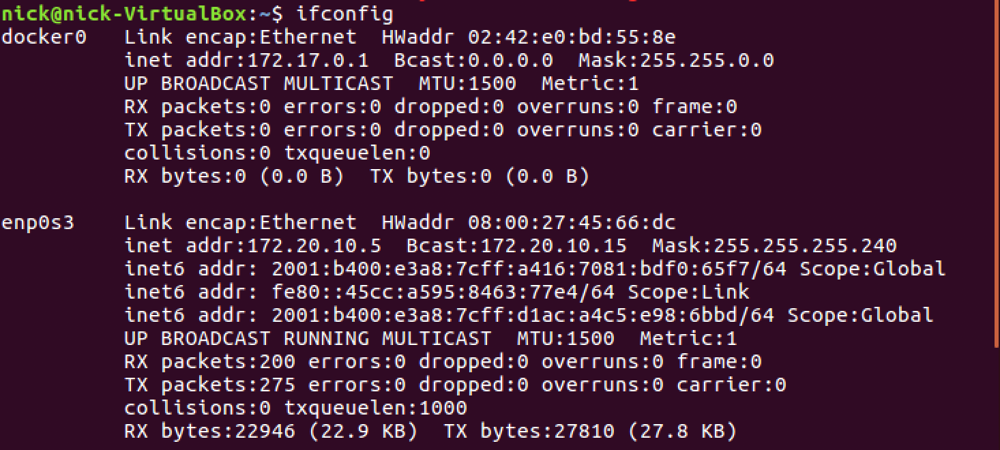

可以注意到ip是172.20.10.5，而網路介面是enp0s3

### 將ssh的service安裝到ubuntu

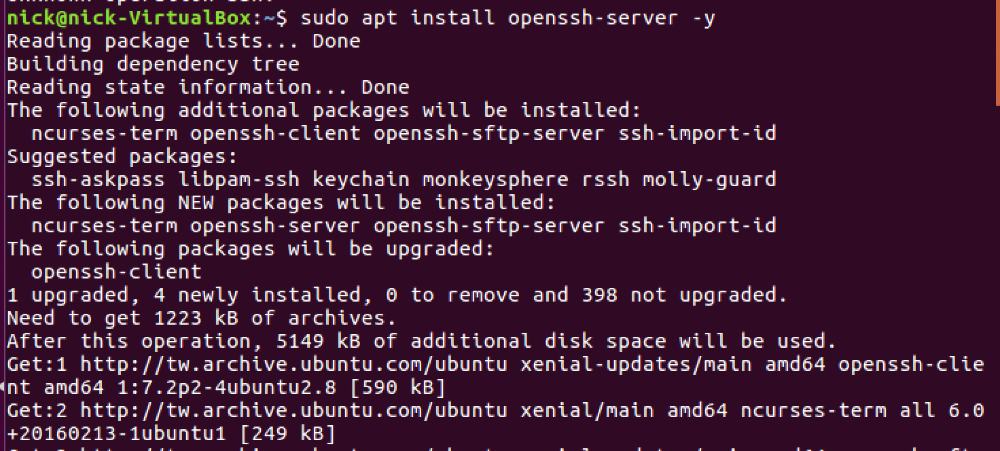

### 確認ssh的service狀態

OK，確認無誤，我們先把Ubuntu關掉

### 設置VirtualBox的網路

網卡一：

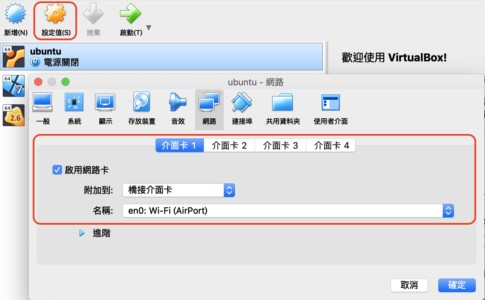

網卡二：

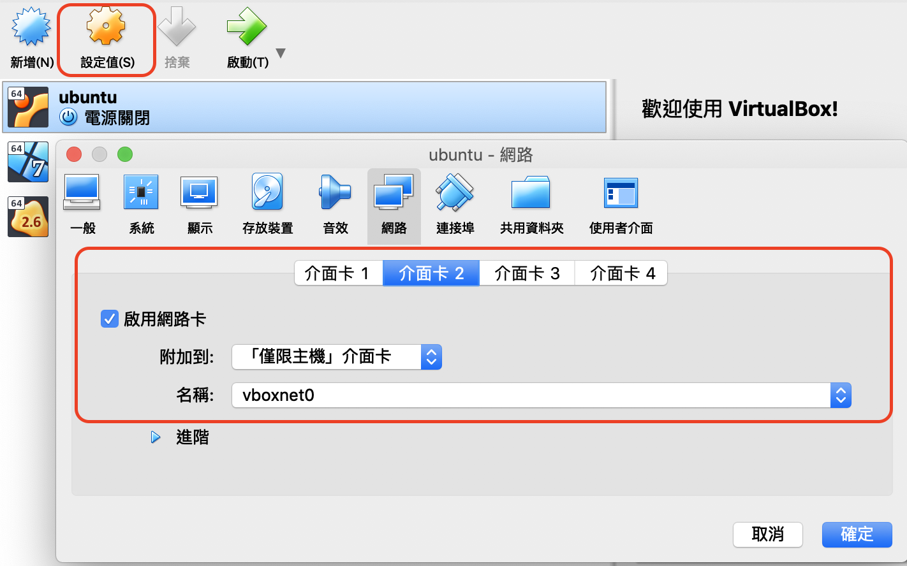

接著啟動VirtualBox，直接把那個畫面縮小

我們從命令列登入

    $ssh nick@192.168.99.100
    nick@192.168.99.100's password:
    Welcome to Ubuntu 16.04.5 LTS (GNU/Linux 4.15.0-42-generic x86_64)
    
     * Documentation:  https://help.ubuntu.com
     * Management:     https://landscape.canonical.com
     * Support:        https://ubuntu.com/advantage
    
    407 packages can be updated.
    283 updates are security updates.
    
    New release '18.04.2 LTS' available.
    Run 'do-release-upgrade' to upgrade to it.
    
    Last login: Sun Oct  6 15:32:38 2019 from 192.168.99.1
    nick@nick-VirtualBox:~$

OK，可以用了，相信有人注意到這個IP是跟minikube的ip是一樣的，這個IP是可以改的，設定靜態IP，可以參考[這裡](http://reneeciou.blogspot.com/2012/04/sshoracle-vm-virtualbox-ubuntu.html)

## 安裝kubectl到Ubuntu

以下皆是在虛擬機的ubuntu操作喔！

接著就要延續上個章節的內容了，我們這邊要：

### 從AWS安裝kubectl

    $curl -o kubectl https://amazon-eks.s3-us-west-2.amazonaws.com/1.13.8/2019-08-14/bin/linux/amd64/kubectl
      % Total    % Received % Xferd  Average Speed   Time    Time     Time  Current
                                     Dload  Upload   Total   Spent    Left  Speed
     16 37.3M   16 6383k    0     0   475k      0  0:01:20  0:00:13  0:01:07  550k

這會花點時間，取決於網路速度，我們等它一下，好了進到下一步

### 賦予kubectl執行權限

    $chmod +x ./kubectl
    $ll kubectl
    -rwxrwxr-x 1 nick nick 39202272  十   6 15:59 kubectl*

### 環境設定

    $mkdir -p $HOME/bin && cp ./kubectl $HOME/bin/kubectl && export PATH=$HOME/bin:$PATH
    $echo 'export PATH=$HOME/bin:$PATH' >> ~/.bashrc

### 檢查kubectl版本

    $kubectl version --short --client
    Client Version: v1.13.11-eks-5876d6

## 安裝 aws-iam-authenticator

### 下載程式

    $curl -o aws-iam-authenticator https://amazon-eks.s3-us-west-2.amazonaws.com/1.13.8/2019-08-14/bin/linux/amd64/aws-iam-authenticator
      % Total    % Received % Xferd  Average Speed   Time    Time     Time  Current
                                     Dload  Upload   Total   Spent    Left  Speed
     49 17.7M   49 8958k    0     0   487k      0  0:00:37  0:00:18  0:00:19 1415k

### 賦予該程式執行權限

    $chmod +x ./aws-iam-authenticator

### 環境設置

    $mkdir -p $HOME/bin && cp ./aws-iam-authenticator $HOME/bin/aws-iam-authenticator && export PATH=$HOME/bin:$PATH
    #$echo 'export PATH=$HOME/bin:$PATH' >> ~/.bashrc

### 檢查程式

    $aws-iam-authenticator help
    A tool to authenticate to Kubernetes using AWS IAM credentials
    
    Usage:
      aws-iam-authenticator [command]
    
    Available Commands:
      help        Help about any command
      init        Pre-generate certificate, private key, and kubeconfig files for the server.
      server      Run a webhook validation server suitable that validates tokens using AWS IAM
      token       Authenticate using AWS IAM and get token for Kubernetes
      verify      Verify a token for debugging purpose
      version     Version will output the current build information
    
    Flags:
      -i, --cluster-id ID       Specify the cluster ID, a unique-per-cluster identifier for your aws-iam-authenticator installation.
      -c, --config filename     Load configuration from filename
      -h, --help                help for aws-iam-authenticator
      -l, --log-format string   Specify log format to use when logging to stderr [text or json] (default "text")
    
    Use "aws-iam-authenticator [command] --help" for more information about a command.

### 檢查Token

這邊我們透過剛安裝的authenticator去驗證，###的部分在[之前](https://www.notion.so/k8s-AWS-EOO-ac4bf2d5da754d689db8419b10107279)下載的accessKeys.csv裡面

    $vim ~/.aws/credentials
    [default]
    aws_access_key_id=###
    aws_secret_access_key=###
    region=ap-southeast-1
    output=json

接著使用這個檔案透過API取得Token

    $aws-iam-authenticator token -i EKS-cluster |python -m json.tool
    {
        "apiVersion": "client.authentication.k8s.io/v1alpha1",
        "kind": "ExecCredential",
        "spec": {},
        "status": {
            "expirationTimestamp": "2019-10-06T09:34:49Z",
            "token": "k8s-aws-v1.aHR0cHM6Ly9zdHMuYW1hem9uYXdzLmNvbS8_QWN0aW9uPUdldENhbGxlcklkZW50aXR5JlZlcnNpb249MjAxMS0wNi0xNSZYLUFtei1BbGdvcml0aG09QVdTNC1ITUFDLVNIQTI1NiZYLUFtei1DcmVkZW50aWFsPUFLSUE2UTZHMjNXWjJCM1BESDdNJTJGMjAxOTEwMDYlMkZ1cy1lYXN0LTElMkZzdHMlMkZhd3M0X3JlcXVlc3QmWC1BbXotRGF0ZT0yMDE5MTAwNlQwOTIwNDlaJlgtQW16LUV4cGlyZXM9MCZYLUFtei1TaWduZWRIZWFkZXJzPWhvc3QlM0J4LWs4cy1hd3MtaWQmWC1BbXotU2lnbmF0dXJlPWE0NWI3ZWIxMzZmYzQwNzE5YzAzZjY5OTllNmE2NjRmNjNkYmEzYzBjNTA3MDRhOGM5NjgwOTAwODY1YjYyM2Y"
        }
    }

### 安裝awscli並驗證

至少要1.16.156以上的版本，下面要設置會比較容易～

    $pip3 install awscli --upgrade --user
    $aws --version
    aws-cli/1.16.253 Python/3.5.2 Linux/4.15.0-42-generic botocore/1.12.243

驗證eks-cluster的設置

    $aws eks describe-cluster --name eks-cluster
    {
        "cluster": {
            "name": "eks-cluster",
            "endpoint": "https://52FFD4287D466FDBCA988199F9392CDE.yl4.ap-southeast-1.eks.amazonaws.com",
            "arn": "arn:aws:eks:ap-southeast-1:998460022195:cluster/eks-cluster",
            "platformVersion": "eks.1",
            "createdAt": 1570166573.41,
            "status": "ACTIVE",
            "tags": {},
            "roleArn": "arn:aws:iam::998460022195:role/EKS-role",
            "identity": {
                "oidc": {
                    "issuer": "https://oidc.eks.ap-southeast-1.amazonaws.com/id/52FFD4287D466FDBCA988199F9392CDE"
                }
            },
            "resourcesVpcConfig": {
                "endpointPrivateAccess": false,
                "vpcId": "vpc-0b8be84996d3d3137",
                "securityGroupIds": [
                    "sg-0b1e94e2029ab91a2"
                ],
                "endpointPublicAccess": true,
                "subnetIds": [
                    "subnet-0f675b47323ac1353",
                    "subnet-093915b91bf9bea5e",
                    "subnet-0d74ce8cc92e08e78"
                ]
            },
            "certificateAuthority": {
                "data": "LS0tLS1CRUdJTiBDRVJUSUZJQ0FURS0tLS0tCk1JSUN5RENDQWJDZ0F3SUJBZ0lCQURBTkJna3Foa2lHOXcwQkFRc0ZBREFWTVJNd0VRWURWUVFERXdwcmRXSmwKY201bGRHVnpNQjRYRFRFNU1UQXdOREExTWprME1Wb1hEVEk1TVRBd01UQTFNamswTVZvd0ZURVRNQkVHQTFVRQpBeE1LYTNWaVpYSnVaWFJsY3pDQ0FTSXdEUVlKS29aSWh2Y05BUUVCQlFBRGdnRVBBRENDQVFvQ2dnRUJBTXFPCmVOS3U4UTN5aGZKa254R2ZGWXFlcndZVXlJZzFMU3p2WUd6SUpGUy9Ld1pJQlA4VS9IQUlBMzZaWFdOdEwxZkQKWnZjZlVQVXBHVS9pY2cyb0lQNHdRcFhnWTFDSC9hVDkzUXhDbk5FQWkyQWRxK1VrU0lqQzk3Q0tBSGJ4aWYxdAp6cElNWVhGaTNMZHNmQ2Fyd3hYWEdmN0E3bGZVUVdSV05TYkFJdnFKeWFwOE1LZ1lQTTVwSUVuWlJEYjFjR1IwCnF1b1Zwa2hmbEtLc1Y4aFJtWlJ0dlFjaTVQcG4vY2VUM2NVbnJ4dFJIajR0M1NDcUcxRllsS0trWHVzanlad1oKMDR6b3EwTkFQK25qQ3B3d3BZMnk1K0ZndVMxWkpwOENTaDE3dXUrWDJkV0NrNHdBRjFzTThQVEV0WjJYdHJHSwpWa09FZFZncDlVV04rS0oxa29FQ0F3RUFBYU1qTUNFd0RnWURWUjBQQVFIL0JBUURBZ0trTUE4R0ExVWRFd0VCCi93UUZNQU1CQWY4d0RRWUpLb1pJaHZjTkFRRUxCUUFEZ2dFQkFCQitpV1RuY3JqaG1Icm5tS1QyaFlBS2tzZDgKeGpOSnZaQk1LUE9HQURsakZGeWZwOTcveVdaang2bFY1QkhUTEszNEszLzNGU1hmclFrdFlnVXkrT1hDYnlLRApSZ3BVRENjMTUrSVB5bC9GVFZkbXl6V1V3a0FieHpRc2ZpVjRKSDRhNTM2UE5tOXBHc3B4dGVSdnFVQWlENVJhCjFkT2V2Z1paaCtLRXc5REZ3aENTcDFRemRtVGhaMmYwNVVQdEVWcmdvaUJFQlcvZFVSenY0c1B0SU0xdnJlVncKcGM5NTgyNFEzZkVWdGJNZmEycHVvVGk5Tm1XRHc0b2xndXZyRWFWMXB2NTR5NXdPTnk5WUFiWS9hK3VYbEY0UgpiNW9sbXVzKzJ2WllEWW9LMi9ZbU8xclFTYi9YYzJobTFKSU9iZVk1eHNiTTRDUWVwUEFzR0w0MWNPdz0KLS0tLS1FTkQgQ0VSVElGSUNBVEUtLS0tLQo="
            },
            "version": "1.14",
            "logging": {
                "clusterLogging": [
                    {
                        "enabled": false,
                        "types": [
                            "api",
                            "audit",
                            "authenticator",
                            "controllerManager",
                            "scheduler"
                        ]
                    }
                ]
            }
        }
    }

### 設置kubectl的config

將<>範圍的字串用EKS上的cluster對應資訊抽換掉

    $vim ~/.kube/config-eks
    apiVersion: v1
    clusters:
    - cluster:
        server: <API server endpoint>
        certificate-authority-data: <Certificate authority>
      name: kubernetes
    contexts:
    - context:
        cluster: kubernetes
        user: aws
      name: aws
    current-context: aws
    kind: Config
    preferences: {}
    users:
    - name: aws
      user:
        exec:
          apiVersion: client.authentication.k8s.io/v1alpha1
          command: aws-iam-authenticator
          args:
            - "token"
            - "-i"
            - "eks-cluster"
            # - "-r"
            # - "<role-arn>"
          # env:
            # - name: AWS_PROFILE
            #   value: "<aws-profile>"

好了之後，檢查下

    $kubectl get svc
    NAME             TYPE        CLUSTER-IP   EXTERNAL-IP   PORT(S)   AGE
    svc/kubernetes   ClusterIP   10.100.0.1   <none>        443/TCP   1m

OK，設置到這邊就結束囉！我們看一個Topic～

# 登入EC2的工作節點

前一段我們已經把集群架設起來了，接著我們要做的事，就是要把Work Node加到集群中。

先回到AWS Management Console，進到CloudFormation

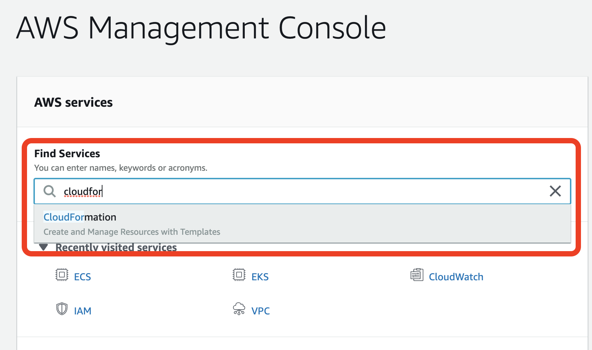

接著新增一個Stack，這個Stack是Node Group

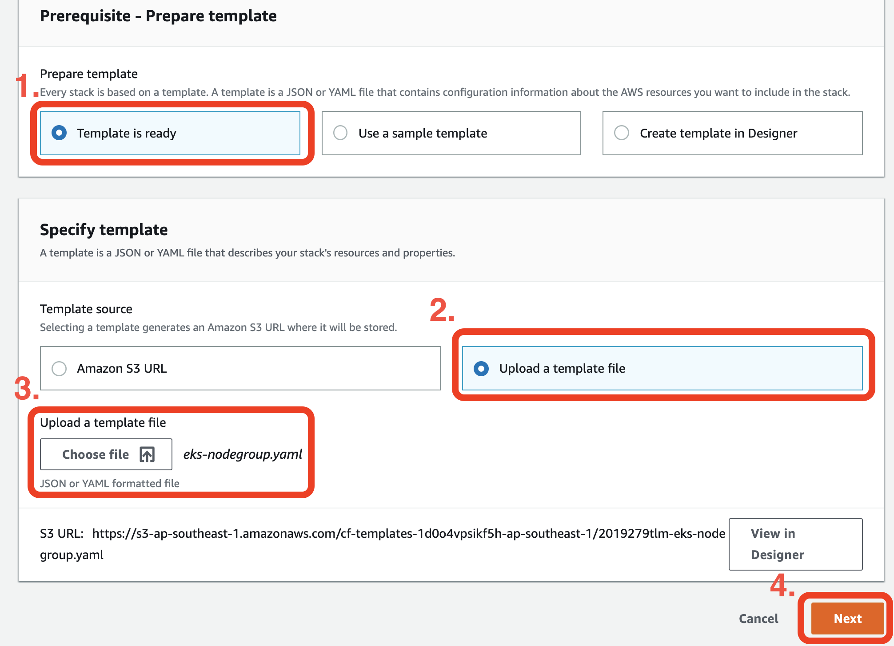

其中的eks-nodegroup.yaml內容如下

    $vim eks-nodegroup.yaml
    ---
    AWSTemplateFormatVersion: '2010-09-09'
    Description: 'Amazon EKS - Node Group'
    
    Parameters:
    
      KeyName:
        Description: The EC2 Key Pair to allow SSH access to the instances
        Type: AWS::EC2::KeyPair::KeyName
        
      NodeImageId:
        Type: AWS::EC2::Image::Id
        Description: AMI id for the node instances.
        Default: ami-0440e4f6b9713faf6
    
      NodeInstanceType:
        Description: EC2 instance type for the node instances
        Type: String
        Default: t2.small
        AllowedValues:
        - t2.small
        - t2.medium
        - t2.large
        - t2.xlarge
        - t2.2xlarge
        - t3.nano
        - t3.micro
        - t3.small
        - t3.medium
        - t3.large
        - t3.xlarge
        - t3.2xlarge
        - m3.medium
        - m3.large
        - m3.xlarge
        - m3.2xlarge
        - m4.large
        - m4.xlarge
        - m4.2xlarge
        - m4.4xlarge
        - m4.10xlarge
        - m5.large
        - m5.xlarge
        - m5.2xlarge
        - m5.4xlarge
        - m5.12xlarge
        - m5.24xlarge
        - c4.large
        - c4.xlarge
        - c4.2xlarge
        - c4.4xlarge
        - c4.8xlarge
        - c5.large
        - c5.xlarge
        - c5.2xlarge
        - c5.4xlarge
        - c5.9xlarge
        - c5.18xlarge
        - i3.large
        - i3.xlarge
        - i3.2xlarge
        - i3.4xlarge
        - i3.8xlarge
        - i3.16xlarge
        - r3.xlarge
        - r3.2xlarge
        - r3.4xlarge
        - r3.8xlarge
        - r4.large
        - r4.xlarge
        - r4.2xlarge
        - r4.4xlarge
        - r4.8xlarge
        - r4.16xlarge
        - x1.16xlarge
        - x1.32xlarge
        - p2.xlarge
        - p2.8xlarge
        - p2.16xlarge
        - p3.2xlarge
        - p3.8xlarge
        - p3.16xlarge
        - r5.large
        - r5.xlarge
        - r5.2xlarge
        - r5.4xlarge
        - r5.12xlarge
        - r5.24xlarge
        - r5d.large
        - r5d.xlarge
        - r5d.2xlarge
        - r5d.4xlarge
        - r5d.12xlarge
        - r5d.24xlarge
        - z1d.large
        - z1d.xlarge
        - z1d.2xlarge
        - z1d.3xlarge
        - z1d.6xlarge
        - z1d.12xlarge
        ConstraintDescription: Must be a valid EC2 instance type
    
      NodeAutoScalingGroupMinSize:
        Type: Number
        Description: Minimum size of Node Group ASG.
        Default: 1
    
      NodeAutoScalingGroupMaxSize:
        Type: Number
        Description: Maximum size of Node Group ASG.
        Default: 3
    
      NodeVolumeSize:
        Type: Number
        Description: Node volume size
        Default: 20
    
      ClusterName:
        Description: The cluster name provided when the cluster was created. If it is incorrect, nodes will not be able to join the cluster.
        Type: String
        Default: EKS-course-cluster
    
      BootstrapArguments:
        Description: Arguments to pass to the bootstrap script. See files/bootstrap.sh in https://github.com/awslabs/amazon-eks-ami
        Default: ""
        Type: String
    
      NodeGroupName:
        Description: Unique identifier for the Node Group.
        Type: String
    
      ClusterControlPlaneSecurityGroup:
        Description: The security group of the cluster control plane.
        Type: AWS::EC2::SecurityGroup::Id
    
      VpcId:
        Description: The VPC of the worker instances
        Type: AWS::EC2::VPC::Id
    
      Subnets:
        Description: The subnets where workers can be created.
        Type: List<AWS::EC2::Subnet::Id>
    
    Metadata:
      AWS::CloudFormation::Interface:
        ParameterGroups:
          -
            Label:
              default: "EKS Cluster"
            Parameters:
              - ClusterName
              - ClusterControlPlaneSecurityGroup
          -
            Label:
              default: "Worker Node Configuration"
            Parameters:
              - NodeGroupName
              - NodeAutoScalingGroupMinSize
              - NodeAutoScalingGroupMaxSize
              - NodeInstanceType
              - NodeImageId
              - NodeVolumeSize
              - KeyName
              - BootstrapArguments
          -
            Label:
              default: "Worker Network Configuration"
            Parameters:
              - VpcId
              - Subnets
    
    Resources:
    
      NodeInstanceProfile:
        Type: AWS::IAM::InstanceProfile
        Properties:
          Path: "/"
          Roles:
          - !Ref NodeInstanceRole
    
      NodeInstanceRole:
        Type: AWS::IAM::Role
        Properties:
          AssumeRolePolicyDocument:
            Version: '2012-10-17'
            Statement:
            - Effect: Allow
              Principal:
                Service:
                - ec2.amazonaws.com
              Action:
              - sts:AssumeRole
          Path: "/"
          ManagedPolicyArns:
            - arn:aws:iam::aws:policy/AmazonEKSWorkerNodePolicy
            - arn:aws:iam::aws:policy/AmazonEKS_CNI_Policy
            - arn:aws:iam::aws:policy/AmazonEC2ContainerRegistryReadOnly
    
      NodeSecurityGroup:
        Type: AWS::EC2::SecurityGroup
        Properties:
          GroupDescription: Security group for all nodes in the cluster
          VpcId:
            !Ref VpcId
          Tags:
          - Key: !Sub "kubernetes.io/cluster/${ClusterName}"
            Value: 'owned'
    
      NodeSecurityGroupIngress:
        Type: AWS::EC2::SecurityGroupIngress
        DependsOn: NodeSecurityGroup
        Properties:
          Description: Allow node to communicate with each other
          GroupId: !Ref NodeSecurityGroup
          SourceSecurityGroupId: !Ref NodeSecurityGroup
          IpProtocol: '-1'
          FromPort: 0
          ToPort: 65535
    
      NodeSecurityGroupFromControlPlaneIngress:
        Type: AWS::EC2::SecurityGroupIngress
        DependsOn: NodeSecurityGroup
        Properties:
          Description: Allow worker Kubelets and pods to receive communication from the cluster control plane
          GroupId: !Ref NodeSecurityGroup
          SourceSecurityGroupId: !Ref ClusterControlPlaneSecurityGroup
          IpProtocol: tcp
          FromPort: 1025
          ToPort: 65535
    
      ControlPlaneEgressToNodeSecurityGroup:
        Type: AWS::EC2::SecurityGroupEgress
        DependsOn: NodeSecurityGroup
        Properties:
          Description: Allow the cluster control plane to communicate with worker Kubelet and pods
          GroupId: !Ref ClusterControlPlaneSecurityGroup
          DestinationSecurityGroupId: !Ref NodeSecurityGroup
          IpProtocol: tcp
          FromPort: 1025
          ToPort: 65535
    
      NodeSecurityGroupFromControlPlaneOn443Ingress:
        Type: AWS::EC2::SecurityGroupIngress
        DependsOn: NodeSecurityGroup
        Properties:
          Description: Allow pods running extension API servers on port 443 to receive communication from cluster control plane
          GroupId: !Ref NodeSecurityGroup
          SourceSecurityGroupId: !Ref ClusterControlPlaneSecurityGroup
          IpProtocol: tcp
          FromPort: 443
          ToPort: 443
    
      ControlPlaneEgressToNodeSecurityGroupOn443:
        Type: AWS::EC2::SecurityGroupEgress
        DependsOn: NodeSecurityGroup
        Properties:
          Description: Allow the cluster control plane to communicate with pods running extension API servers on port 443
          GroupId: !Ref ClusterControlPlaneSecurityGroup
          DestinationSecurityGroupId: !Ref NodeSecurityGroup
          IpProtocol: tcp
          FromPort: 443
          ToPort: 443
    
      ClusterControlPlaneSecurityGroupIngress:
        Type: AWS::EC2::SecurityGroupIngress
        DependsOn: NodeSecurityGroup
        Properties:
          Description: Allow pods to communicate with the cluster API Server
          GroupId: !Ref ClusterControlPlaneSecurityGroup
          SourceSecurityGroupId: !Ref NodeSecurityGroup
          IpProtocol: tcp
          ToPort: 443
          FromPort: 443
    
      NodeGroup:
        Type: AWS::AutoScaling::AutoScalingGroup
        Properties:
          DesiredCapacity: !Ref NodeAutoScalingGroupMaxSize
          LaunchConfigurationName: !Ref NodeLaunchConfig
          MinSize: !Ref NodeAutoScalingGroupMinSize
          MaxSize: !Ref NodeAutoScalingGroupMaxSize
          VPCZoneIdentifier:
            !Ref Subnets
          Tags:
          - Key: Name
            Value: !Sub "${ClusterName}-${NodeGroupName}-Node"
            PropagateAtLaunch: 'true'
          - Key: !Sub 'kubernetes.io/cluster/${ClusterName}'
            Value: 'owned'
            PropagateAtLaunch: 'true'
        UpdatePolicy:
          AutoScalingRollingUpdate:
            MinInstancesInService: '1'
            MaxBatchSize: '1'
    
      NodeLaunchConfig:
        Type: AWS::AutoScaling::LaunchConfiguration
        Properties:
          AssociatePublicIpAddress: 'true'
          IamInstanceProfile: !Ref NodeInstanceProfile
          ImageId: !Ref NodeImageId
          InstanceType: !Ref NodeInstanceType
          KeyName: !Ref KeyName
          SecurityGroups:
          - !Ref NodeSecurityGroup
          BlockDeviceMappings:
            - DeviceName: /dev/xvda
              Ebs:
                VolumeSize: !Ref NodeVolumeSize
                VolumeType: gp2
                DeleteOnTermination: true
          UserData:
            Fn::Base64:
              !Sub |
                #!/bin/bash
                set -o xtrace
                /etc/eks/bootstrap.sh ${ClusterName} ${BootstrapArguments}
                /opt/aws/bin/cfn-signal --exit-code $? \
                         --stack  ${AWS::StackName} \
                         --resource NodeGroup  \
                         --region ${AWS::Region}
    
    Outputs:
      NodeInstanceRole:
        Description: The node instance role
        Value: !GetAtt NodeInstanceRole.Arn
      NodeSecurityGroup:
        Description: The security group for the node group
        Value: !Ref NodeSecurityGroup

再來是一些其他參數的設定

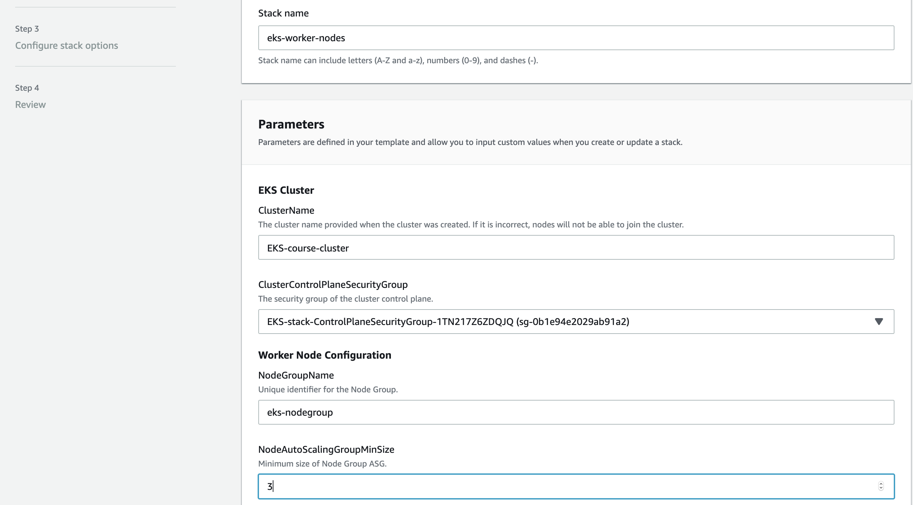

注意到AMI的部分，這個需要最佳化設定，參考[這裡](https://docs.aws.amazon.com/zh_tw/eks/latest/userguide/getting-started-console.html)

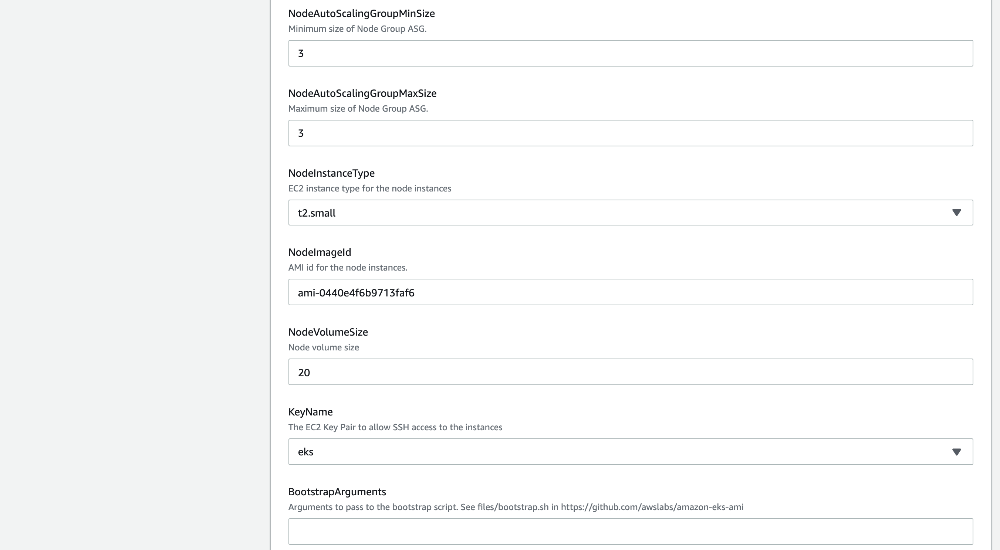

三個Subnet都要放上去

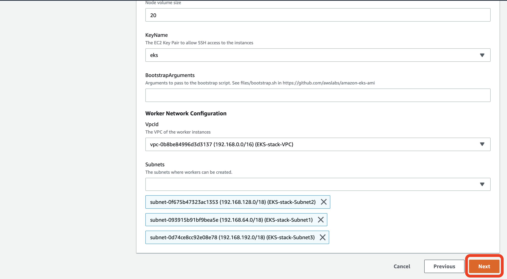

大致這樣，好了下一步，按Next

後面只是總覽，不用改，直接Create Stack就好

要稍等一下，好了之後我們去看一下EC2，那邊會有三台機器開起來

我們到Security Group那邊的NodeGroup去加個SSH的設置

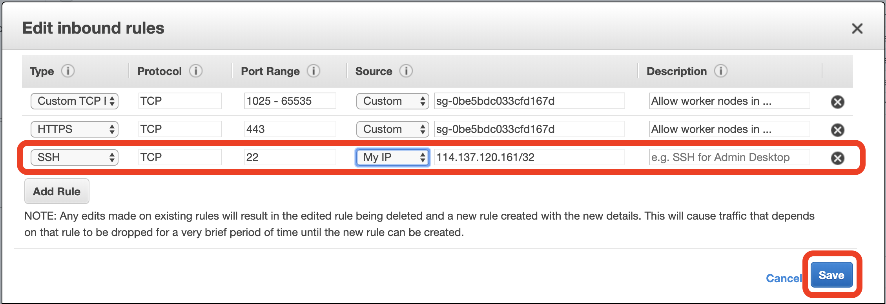

檢查Instance的IP

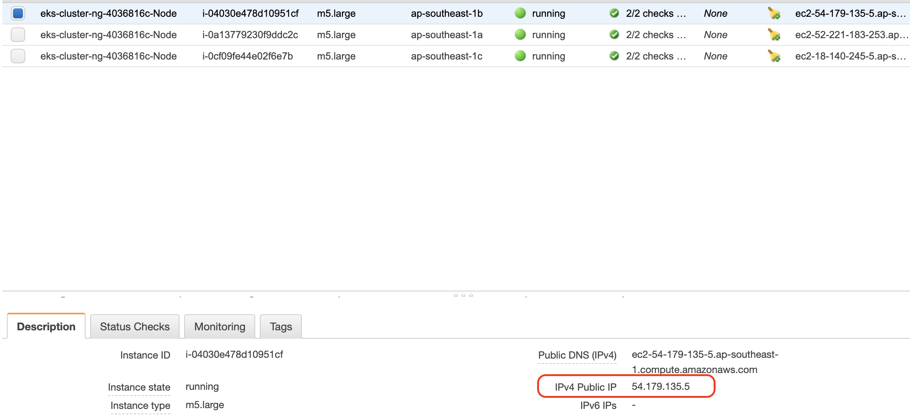

這樣的話，就能利用前面的eks.pem連進去囉

    $ssh -i ~/.ssh/eks.pem ec2-user@54.179.135.5

我們檢查下節點狀態

    $kubectl get no
    No resources found

看樣子還沒結束，要在k8s集群裡面改ConfigMap才能確保節點順利加入

    $vim aws-auth.yaml
    apiVersion: v1
    kind: ConfigMap
    metadata:
      name: aws-auth
      namespace: kube-system
    data:
      mapRoles: |
        - rolearn: <role-arn-from-previous-step>
          username: system:node:{{EC2PrivateDNSName}}
          groups:
            - system:bootstrappers
            - system:nodes

其中<role-arn-from-previous-step>要換成下方反白內容

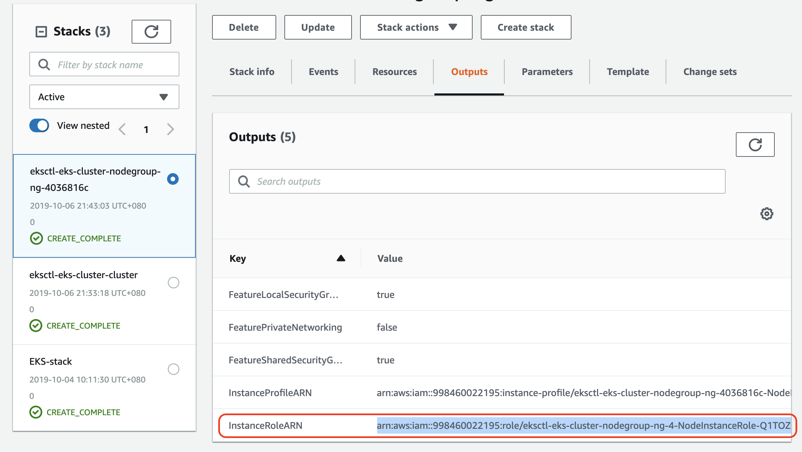

好了apply一下，官方有說這個檔案的其他內容最好不要亂動

    $kubectl apply -f aws-auth.yaml
    configmap "aws-auth" configured

最後我們可以看到集群的節點狀態

    $kubectl get no
    NAME                                                STATUS   ROLES    AGE   VERSION
    ip-192-168-4-101.ap-southeast-1.compute.internal    Ready    <none>   10m   v1.13.8-eks-cd3eb0
    ip-192-168-54-227.ap-southeast-1.compute.internal   Ready    <none>   10m   v1.13.8-eks-cd3eb0
    ip-192-168-77-210.ap-southeast-1.compute.internal   Ready    <none>   10m   v1.13.8-eks-cd3eb0

OK，雲端AWS的集群設置完畢了！

# 小祕技：用eksctl架設集群

如果你覺得這樣設置實在累到爆，筆者傳授必殺技給你

我們其實可以直接利用eksctl設置，讓我們感受一下

## 下載並安裝eksctl

    $curl --silent --location "https://github.com/weaveworks/eksctl/releases/download/latest_release/eksctl_$(uname -s)_amd64.tar.gz" | tar xz -C /tmp
    $sudo mv /tmp/eksctl /usr/local/bin
    $eksctl version
    [ℹ]  version.Info{BuiltAt:"", GitCommit:"", GitTag:"0.6.0"}

## eksctl架設群集

創建一個新群集，名稱是eks-cluster，3個節點，使用新加坡的網域

    $eksctl create cluster --name=eks-cluster --nodes=3 --region=ap-southeast-1
    [ℹ]  using region ap-southeast-1
    [ℹ]  setting availability zones to [ap-southeast-1b ap-southeast-1c ap-southeast-1a]
    [ℹ]  subnets for ap-southeast-1b - public:192.168.0.0/19 private:192.168.96.0/19
    [ℹ]  subnets for ap-southeast-1c - public:192.168.32.0/19 private:192.168.128.0/19
    [ℹ]  subnets for ap-southeast-1a - public:192.168.64.0/19 private:192.168.160.0/19
    [ℹ]  nodegroup "ng-4036816c" will use "ami-06206d907abb34bbc" [AmazonLinux2/1.13]
    [ℹ]  using Kubernetes version 1.13
    [ℹ]  creating EKS cluster "eks-cluster" in "ap-southeast-1" region
    [ℹ]  will create 2 separate CloudFormation stacks for cluster itself and the initial nodegroup
    [ℹ]  if you encounter any issues, check CloudFormation console or try 'eksctl utils describe-stacks --region=ap-southeast-1 --name=eks-cluster'
    [ℹ]  CloudWatch logging will not be enabled for cluster "eks-cluster" in "ap-southeast-1"
    [ℹ]  you can enable it with 'eksctl utils update-cluster-logging --region=ap-southeast-1 --name=eks-cluster'
    [ℹ]  2 sequential tasks: { create cluster control plane "eks-cluster", create nodegroup "ng-4036816c" }
    [ℹ]  building cluster stack "eksctl-eks-cluster-cluster"
    [ℹ]  deploying stack "eksctl-eks-cluster-cluster"
    [ℹ]  building nodegroup stack "eksctl-eks-cluster-nodegroup-ng-4036816c"
    [ℹ]  --nodes-min=3 was set automatically for nodegroup ng-4036816c
    [ℹ]  --nodes-max=3 was set automatically for nodegroup ng-4036816c
    [ℹ]  deploying stack "eksctl-eks-cluster-nodegroup-ng-4036816c"
    [✔]  all EKS cluster resource for "eks-cluster" had been created
    [✔]  saved kubeconfig as "/home/nick/.kube/config-eks"
    [ℹ]  adding role "arn:aws:iam::998460022195:role/eksctl-eks-cluster-nodegroup-ng-4-NodeInstanceRole-Q1TOZ0IQQ6E0" to auth ConfigMap
    [ℹ]  nodegroup "ng-4036816c" has 0 node(s)
    [ℹ]  waiting for at least 3 node(s) to become ready in "ng-4036816c"
    [ℹ]  nodegroup "ng-4036816c" has 3 node(s)
    [ℹ]  node "ip-192-168-4-101.ap-southeast-1.compute.internal" is ready
    [ℹ]  node "ip-192-168-54-227.ap-southeast-1.compute.internal" is ready
    [ℹ]  node "ip-192-168-77-210.ap-southeast-1.compute.internal" is ready
    [ℹ]  kubectl command should work with "/home/nick/.kube/config-eks", try 'kubectl --kubeconfig=/home/nick/.kube/config-eks get nodes'
    [✔]  EKS cluster "eks-cluster" in "ap-southeast-1" region is ready

這會花一點時間，大概要20分左右

前面不提的原因是，如果一開始就這樣設置了，那麼發生問題的時候，因為AWS元件熟練度不足，會要花更多時間排錯^_^

# 小結

今天我們看到了雲端AWS集群的架設方式，下卷結束了，整體來說介紹應該算蠻完整的，我們也學習到了eksctl初步的使用，它可以讓我們快速的架設群集，跟Kops速度上感覺差不多，當然目前感覺Kops的控制項還是比較多的，明天開始會在雲端的群集操作了，我們可以開始看到雲端和區網的不同，加油！明天見了！

# 參考資料

- [EKS升級k8s](https://docs.aws.amazon.com/zh_tw/eks/latest/userguide/update-cluster.html)
- [AWS Management Console](https://docs.aws.amazon.com/zh_tw/eks/latest/userguide/getting-started-console.html)
- [VirtualBox使用SSH](http://reneeciou.blogspot.com/2012/04/sshoracle-vm-virtualbox-ubuntu.html)
- [AWS安裝kubectl](https://docs.aws.amazon.com/zh_tw/eks/latest/userguide/install-kubectl.html)
- [AWS安裝iam認證器](https://docs.aws.amazon.com/zh_tw/eks/latest/userguide/install-aws-iam-authenticator.html)
- [AWS驗證用戶角色](https://docs.aws.amazon.com/zh_tw/eks/latest/userguide/add-user-role.html)
- [AWS架設群集排錯方式](https://docs.aws.amazon.com/zh_tw/eks/latest/userguide/troubleshooting.html#unauthorized)
- [eksctl的安裝使用](https://docs.aws.amazon.com/zh_tw/eks/latest/userguide/eksctl.html)

本文同步刊載於[https://github.com/x1y2z3456/ironman](https://github.com/x1y2z3456/ironman)

感謝您撥冗閱讀此文章，不喜勿噴，有任何問題建議歡迎下方留言：）

說個笑話，希望我能寫滿30天啊（笑