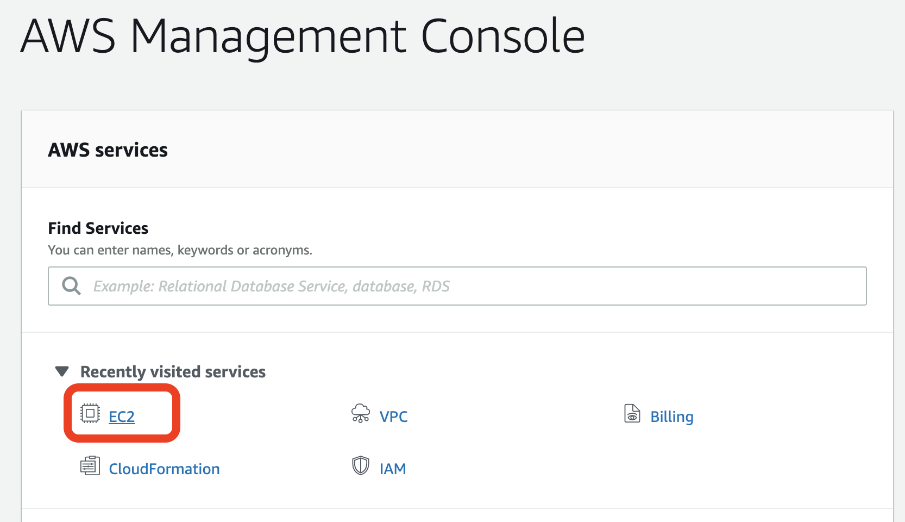
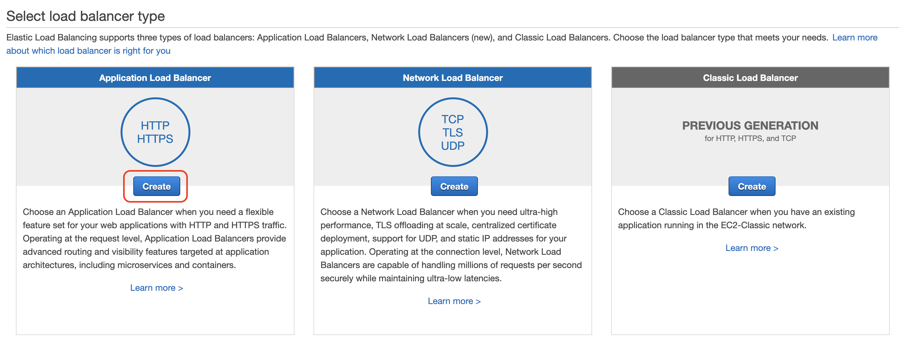
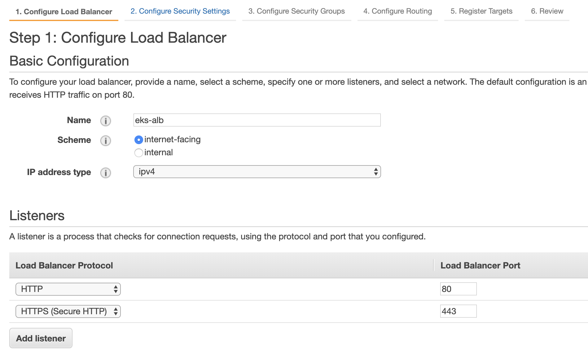
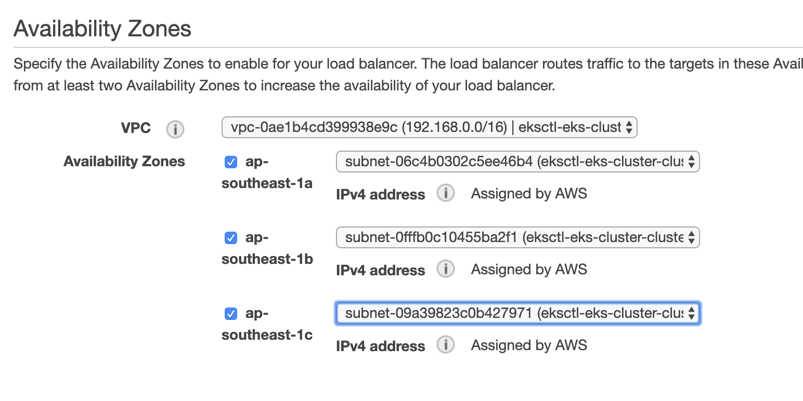
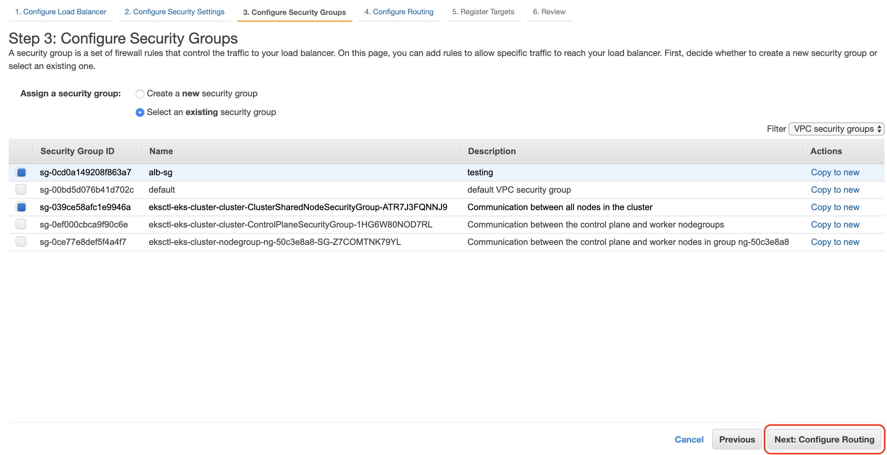

# 第二十三天：k8s進階篇延伸與EKS（一）

Author: Nick Zhuang
Type: kubernetes

# 前言

昨天我們看完了基礎篇的內容，今天開始我們要來瀏覽在進階篇的範疇內，minikube與EKS不同的地方，關於進階篇的內容分為兩篇，第一篇主要著重於Ingress及Service的部分，我們將著重於在AWS上實做一個traefik的Ingress，之前在minikube上實做的是nginx的Ingress，可以比較一下差異。第二篇是講述Affinity and Anti-Affinity、Taints and Tolerations、Cordon and Uncordon and Drain結合應用的內容。我們不會再檢視StatefulSet和DaemonSet的內容，因為他們的操作方法與Deployment類似，回顧可以參考[這裡](https://github.com/x1y2z3456/ironman/tree/master/day11)。

# 進階篇

## Ingress

接著我們在既有的AWS群集上，實作一個traefik Ingress，這個操作同時也會與Service有關，我們的目標是透過這個Ingress達到ALB（Application Load Balancer）的目的。

    $mkdir traefik
    $cd treafik

### 創建YAML並APPLY

我們先新增幾個檔案，將他們置於traefik的目錄底下

新增app.yaml

    $vim app.yaml
    apiVersion: v1
    kind: Service
    metadata: 
      name: greeting-service
    spec: 
      selector: 
        app: greeting-pod
      ports:
        - name: web
          port: 80
          targetPort: 8080
      #type: NodePort
    ---
    apiVersion: extensions/v1beta1
    kind: Deployment
    metadata:
      name: greeting
    spec:
      replicas: 2
      template:
        metadata:
          labels:
            app: greeting-pod
        spec:
          tolerations:
          - key: "spotInstance"
            # operator: "Exists"
            value: "true"
            effect: "PreferNoSchedule"   
          containers:
          - name: greeting-pod
            image: pahud/greeting:latest
            env:
            - name: MY_TYPE
              value: greeting
            ports:
            - containerPort: 8080
    ---
    apiVersion: v1
    kind: Service
    metadata: 
      name: caddy-service
    spec: 
      selector: 
        app: caddy-pod
      ports:
        - name: web
          port: 80
          targetPort: 2015
      #type: NodePort
    ---
    apiVersion: extensions/v1beta1
    kind: Deployment
    metadata:
      name: caddy
    spec:
      replicas: 2
      template:
        metadata:
          labels:
            app: caddy-pod
        spec:
          containers:
          - name: caddy-pod
            image: abiosoft/caddy:php
            #image: abiosoft/caddy
            env:
            - name: MY_TYPE
              value: caddy
            ports:
            - containerPort: 2015
    ---
    apiVersion: v1
    kind: Service
    metadata: 
      name: nginx-service
    spec: 
      selector: 
        app: nginx-pod
      ports:
        - name: web
          port: 80
          targetPort: 80
      #type: NodePort
    ---
    apiVersion: extensions/v1beta1
    kind: Deployment
    metadata:
      name: nginx
    spec:
      replicas: 2
      template:
        metadata:
          labels:
            app: nginx-pod
        spec:
          containers:
          - name: nginx-pod
            image: nginx
            env:
            - name: MY_TYPE
              value: nginx
            ports:
            - containerPort: 80

新增caddy.yaml

    $vim caddy.yaml
    ---
    apiVersion: v1
    kind: Service
    metadata: 
      name: caddy-service
    spec: 
      selector: 
        app: caddy-pod
      ports:
        - name: web
          port: 80
          targetPort: 2015
      #type: NodePort
    ---
    apiVersion: extensions/v1beta1
    kind: Deployment
    metadata:
      name: caddy
    spec:
      replicas: 2
      template:
        metadata:
          labels:
            app: caddy-pod
        spec:
          containers:
          - name: caddy-pod
            image: abiosoft/caddy:php
            #image: abiosoft/caddy
            env:
            - name: MY_TYPE
              value: caddy
            ports:
            - containerPort: 2015

新增ingress-rbac.yaml

    $vim ingress-rbac.yaml
    apiVersion: v1
    kind: ServiceAccount
    metadata:
      name: ingress
      namespace: kube-system
    ---
    kind: ClusterRoleBinding
    apiVersion: rbac.authorization.k8s.io/v1beta1
    metadata:
      name: ingress
    subjects:
      - kind: ServiceAccount
        name: ingress
        namespace: kube-system
    roleRef:
      kind: ClusterRole
      name: cluster-admin
      apiGroup: rbac.authorization.k8s.io

這個部分我們之前有提過，rbac是基於角色的權限控制

新增ingress.yaml

    $vim ingress.yaml
    apiVersion: extensions/v1beta1
    kind: Ingress
    metadata:
      name: traefik-ingress
      namespace: default
      annotations:
        kubernetes.io/ingress.class: traefik
        traefik.frontend.rule.type: PathPrefixStrip
    spec:
      rules:
      - 
        #host: greeting.xxx.io
        http:
          paths:
          - path: /
            backend:
              serviceName: greeting-service
              servicePort: 80
      - 
        #host: caddy.xxx.io
        http:
          paths:
          - path: /caddy
            backend:
              serviceName: caddy-service
              servicePort: 80
      - 
        #host: nginx.xxx.io
        http:
          paths:
          - path: /nginx
            backend:
              serviceName: nginx-service
              servicePort: 80

新增traefik-ingress-lb-svc.yaml

    $vim traefik-ingress-lb-svc.yaml
    apiVersion: v1
    kind: Service
    metadata:
      name: traefik-ingress-lb-svc
      namespace: kube-system
    spec:
      selector:
        name: traefik-ingress-lb
      ports:
        - name: web
          port: 80
          targetPort: 80
          nodePort: 31742
      #type: LoadBalancer
      type: NodePort

新增traefik-ingress-lb.yaml

    $vim traefik-ingress-lb.yaml
    apiVersion: extensions/v1beta1
    kind: DaemonSet
    metadata:
      name: traefik-ingress-lb
      namespace: kube-system
      labels:
        k8s-app: traefik-ingress-lb
    spec:
      template:
        metadata:
          labels:
            k8s-app: traefik-ingress-lb
            name: traefik-ingress-lb
        spec:
          terminationGracePeriodSeconds: 60
          hostNetwork: true
          restartPolicy: Always
          serviceAccountName: ingress
          containers:
          - image: traefik
            name: traefik-ingress-lb
            resources:
              limits:
                cpu: 200m
                memory: 30Mi
              requests:
                cpu: 100m
                memory: 20Mi
            ports:
            - name: http
              containerPort: 80
              hostPort: 80
            - name: admin
              containerPort: 8580
              hostPort: 8580
            args:
            - --web
            - --web.address=:8580
            - --kubernetes
          nodeSelector:
             lifecycle: "OnDemand"

最後直接apply

    $kubectl apply -f .
    service/greeting-service created
    deployment.extensions/greeting created
    service/caddy-service created
    deployment.extensions/caddy created
    service/nginx-service created
    deployment.extensions/nginx created
    service/caddy-service unchanged
    deployment.extensions/caddy unchanged
    ingress.extensions/traefik-ingress created
    serviceaccount/ingress created
    clusterrolebinding.rbac.authorization.k8s.io/ingress created
    service/traefik-ingress-lb-svc created
    daemonset.extensions/traefik-ingress-lb created

檢查Service狀態

    $kubectl get svc
    NAME               TYPE        CLUSTER-IP       EXTERNAL-IP   PORT(S)   AGE
    caddy-service      ClusterIP   10.100.3.198     <none>        80/TCP    26s
    greeting-service   ClusterIP   10.100.175.157   <none>        80/TCP    26s
    kubernetes         ClusterIP   10.100.0.1       <none>        443/TCP   24m
    nginx-service      ClusterIP   10.100.144.155   <none>        80/TCP    25s

檢查系統Service

    $kubectl get svc -n kube-system
    NAME                     TYPE        CLUSTER-IP       EXTERNAL-IP   PORT(S)         AGE
    kube-dns                 ClusterIP   10.100.0.10      <none>        53/UDP,53/TCP   26m
    traefik-ingress-lb-svc   NodePort    10.100.228.154   <none>        80:**31742**/TCP    2m26s

檢查Ingress狀態

    $kubectl get ing
    NAME              HOSTS   ADDRESS   PORTS   AGE
    traefik-ingress   *                 80      36s
    $kubectl describe ing/traefik-ingress
    Name:             traefik-ingress
    Namespace:        default
    Address:
    Default backend:  default-http-backend:80 (<none>)
    Rules:
      Host  Path  Backends
      ----  ----  --------
      *
            /   greeting-service:80 (<none>)
      *
            /caddy   caddy-service:80 (<none>)
      *
            /nginx   nginx-service:80 (<none>)
    Annotations:
      kubernetes.io/ingress.class:                       traefik
      traefik.frontend.rule.type:                        PathPrefixStrip
      kubectl.kubernetes.io/last-applied-configuration:  {"apiVersion":"extensions/v1beta1","kind":"Ingress","metadata":{"annotations":{"kubernetes.io/ingress.class":"traefik","traefik.frontend.rule.type":"PathPrefixStrip"},"name":"traefik-ingress","namespace":"default"},"spec":{"rules":[{"http":{"paths":[{"backend":{"serviceName":"greeting-service","servicePort":80},"path":"/"}]}},{"http":{"paths":[{"backend":{"serviceName":"caddy-service","servicePort":80},"path":"/caddy"}]}},{"http":{"paths":[{"backend":{"serviceName":"nginx-service","servicePort":80},"path":"/nginx"}]}}]}}
    
    Events:  <none>

OK，看起來沒啥問題

### 設置AWS的ALB

先切換到Management Console，到EC2

接著到Load Balancers

Create Load Balancer

建立ALB

設置一些參數

設置Security Group

最後將節點加入註冊，這樣才能監看

好了會顯示這樣

還要再檢查Target Group，記得Forward到31742

最後我們透過設置好的ALB的DNS Name去測試

    $curl http://eks-alb-610645758.ap-southeast-1.elb.amazonaws.com/caddy |grep head -n1
    <title>Caddy</title>
    $curl http://eks-alb-610645758.ap-southeast-1.elb.amazonaws.com/nginx |grep head -n1
    <title>Welcome to nginx!</title>

OK，可以發現到透過設置Load Balancer達到依所設置的名稱，使用指定的Service的效果！

這個Ingress還可以設置Dashboard，這部分就留給讀者自行探索囉！
好了恢復原狀

    $kubectl delete -f .
    service "greeting-service" deleted
    deployment.extensions "greeting" deleted
    service "caddy-service" deleted
    deployment.extensions "caddy" deleted
    service "nginx-service" deleted
    deployment.extensions "nginx" deleted
    ingress.extensions "traefik-ingress" deleted
    serviceaccount "ingress" deleted
    clusterrolebinding.rbac.authorization.k8s.io "ingress" deleted
    service "traefik-ingress-lb-svc" deleted
    daemonset.extensions "traefik-ingress-lb" deleted

# 小結

比對之前所設置的minikube可以發現到，主要是後面的Load Balancer要在AWS上設置，所以必須要了解在上面的設置方法，這個例子套用了我們之前所學習過的Service概念，並利用Ingress達到我們所要的效果，在AWS上的時候，我們可以透過妥善的設置我們的Load Balancer，去有效的降低系統的負荷、或是做Service的管理分流。

# 參考連結

- [AWS的Traefik Ingress設置](https://github.com/pahud/amazon-eks-workshop/tree/master/03-creating-services/ingress/traefik-ingress)
- [Traefik Ingress安裝](https://jimmysong.io/kubernetes-handbook/practice/traefik-ingress-installation.html)
