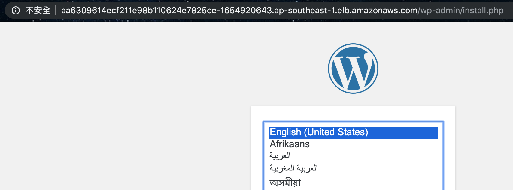
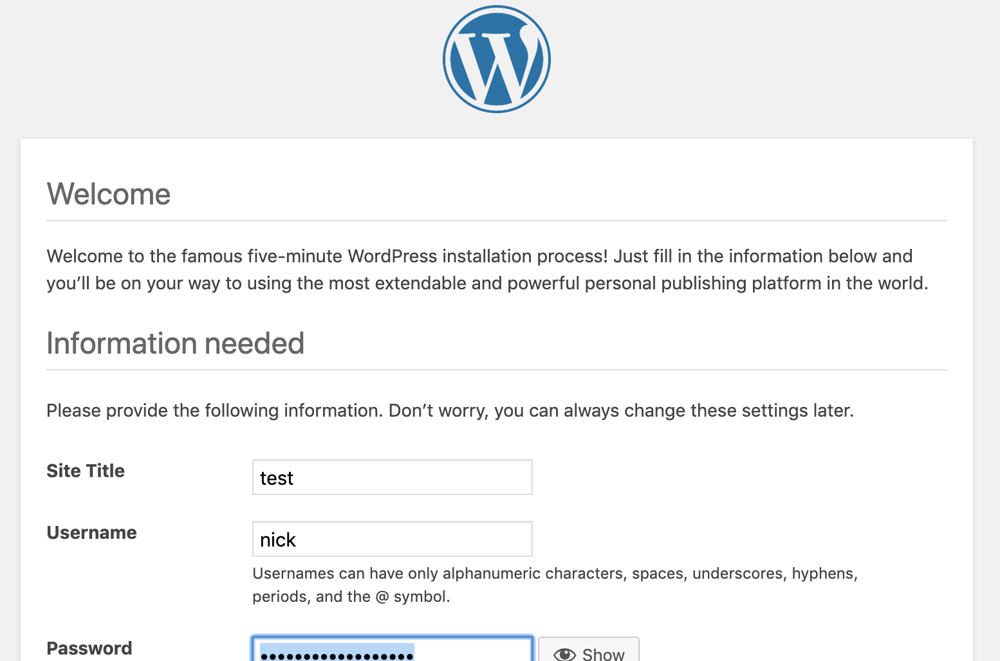
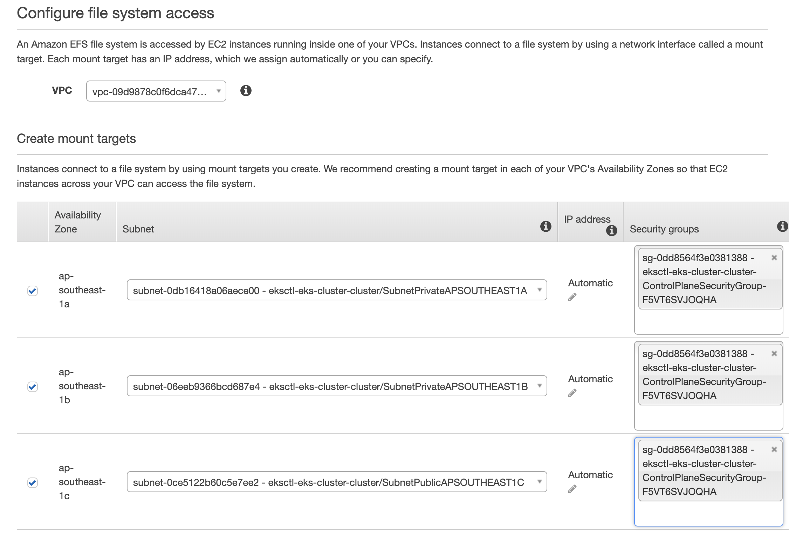
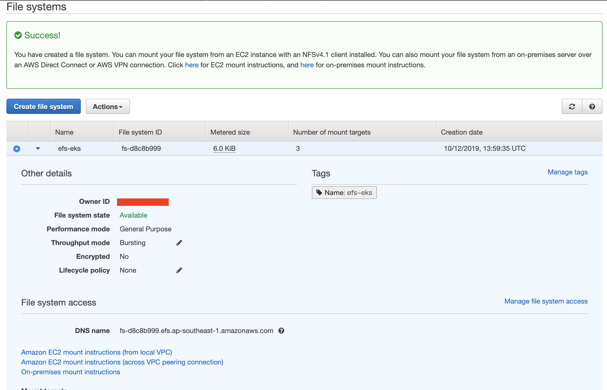
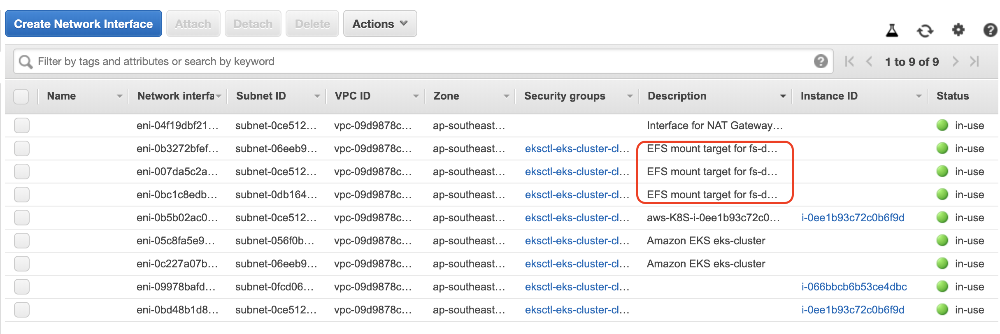
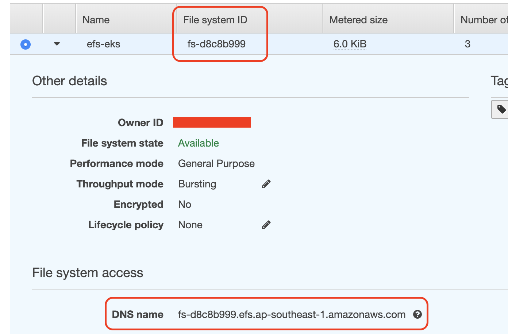

# [Day28] k8s應用篇（二）：EBS和EFS的使用

Author: Nick Zhuang
Type: kubernetes

# 前言

今天我們來看個整合性例子，講述了Wordpress與MySQL的結合，同樣的做法分為兩種，第一種是透過EBS去實作它，第二種方法是透過EFS去實作它，那麼接下來我們就開始吧！

由於操作會用到PV，我們這裡小複習一下

複習傳送門：

- [[Day16] k8s之PV小整合：Pod、Deployment、Service、Job與PersistentVolume](https://github.com/x1y2z3456/ironman/tree/master/day16)
- [[Day19] k8s上雲端之路：AWS之蓄勢待發：EOO](https://github.com/x1y2z3456/ironman/tree/master/day19)

# EBS

這裡之前有提過，我們複習下：

Elastic Block Store (EBS) 是易於使用的高效能區塊儲存服務，專為與Elastic Compute Cloud (EC2) 搭配使用而設計，能以任何規模同時用於輸送量和交易密集型工作負載。各種工作負載 (如關聯式和非關聯式資料庫、企業應用程式、容器化的應用程式、大數據分析引擎、檔案系統和媒體工作流程) 廣泛部署在 EBS 上。

這邊示範如何透過設置EBS達到實作Wordpress結合MySQL的效果。

## 1. 新增虛擬集群（Namespace）

檢查既有的Namespace

    $kubectl get namespaces
    NAME          STATUS   AGE
    default       Active   17m
    kube-public   Active   17m
    kube-system   Active   17m

新增一個Namespace

    $kubectl create namespace ns-eks
    namespace/ns-eks created

檢查既有的Namespace

    $kubectl get namespaces
    NAME          STATUS   AGE
    default       Active   18m
    kube-public   Active   18m
    kube-system   Active   18m
    ns-eks        Active   13s

針對該Namespace，也就是ns-eks，可以發現他有Secret，它這裡有token供Dashboard使用

    $kubectl get secret -n ns-eks
    NAME                  TYPE                                  DATA   AGE
    default-token-vkv4l   kubernetes.io/service-account-token   3      3m17s

## 2. 新增實體卷（physical volume）

檢查StorageClass

    $kubectl get storageclasses --all-namespaces
    NAME            PROVISIONER             AGE
    gp2 (default)   kubernetes.io/aws-ebs   26m

發現到有gp2，而且這個位置是在我們新增的Namespace上：ns-eks

    $kubectl get storageclasses -n ns-eks
    NAME            PROVISIONER             AGE
    gp2 (default)   kubernetes.io/aws-ebs   28m

如果你發現沒有，可以參考下面新增

    $vim gp2-storage-class.yaml
    kind: StorageClass
    apiVersion: storage.k8s.io/v1
    metadata:
      name: gp2
    provisioner: kubernetes.io/aws-ebs
    parameters:
      type: gp2
    reclaimPolicy: Retain
    mountOptions:
      - debug

這邊講解一下參數使用：

`kind`：元件的種類，如：Pod、Deployment等等

`apiVersion`：支援的API版本

`metadata`：這個元件的附加資訊，像是名稱、標籤等等

`provisioner`：存儲類的供應者，這裡是AWS

`parameters`：一些其他參數，這裡有定義種類是gp2

`reclaimPolicy`：指定的回收策略，預設是Delete，也就是當StorageClass掰掰的時候，它會將存儲卷刪掉，Retain則相反，會保留存儲卷

`mountOptions`：掛載選項，對應被掛載的地方應要支援不然會失敗

如果k8s是1.10版：

- 套用gp2設置

    $kubectl apply -f gp2-storage-class.yaml -n ns-eks
    storageclass.storage.k8s.io "gp2" created

- 將gps設為default

    $kubectl patch storageclass gp2 -p '{"metadata": {"annotations":{"storageclass.kubernetes.io/is-default-class":"true"}}}' -n=ns-eks

不是的話就都不用做，應該剛開始就如同筆者畫面所顯示的

    $kubectl get storageclasses -n ns-eks
    NAME            PROVISIONER             AGE
    gp2 (default)   kubernetes.io/aws-ebs   28m

新增PersistentVolumeClaim

    $vim pvcs.yaml
    apiVersion: v1
    kind: PersistentVolumeClaim
    metadata:
      name: mysql-pv-claim
      labels:
        app: wordpress
    spec:
      accessModes:
        - ReadWriteOnce
      resources:
        requests:
          storage: 20Gi
    ---
    apiVersion: v1
    kind: PersistentVolumeClaim
    metadata:
      name: wp-pv-claim
      labels:
        app: wordpress
    spec:
      accessModes:
        - ReadWriteOnce
      resources:
        requests:
          storage: 20Gi

接著apply它

    $kubectl apply -f pvcs.yaml -n ns-eks
    persistentvolumeclaim/mysql-pv-claim created
    persistentvolumeclaim/wp-pv-claim created

檢查PVC狀態

    $kubectl get pvc -n ns-eks
    NAME             STATUS   VOLUME                                     CAPACITY   ACCESS MODES   STORAGECLASS   AGE
    mysql-pv-claim   Bound    pvc-6cc434b5-ecee-11e9-a674-0a822e4a246e   20Gi       RWO            gp2            39s
    wp-pv-claim      Bound    pvc-6cf53941-ecee-11e9-a674-0a822e4a246e   20Gi       RWO            gp2            39s

注意到他們都已經Bound了，也就是已綁定的狀態，可以用囉！

我們檢查下AWS的EBS

有的！

## 3. 部署MySQL後端

新增一個Secret

    $kubectl create secret generic mysql-pass --from-literal=password=eks-mysql-pw --namespace=ns-eks
    secret/mysql-pass created

檢查Secret狀態

    $kubectl get secret -n ns-eks
    NAME                  TYPE                                  DATA   AGE
    default-token-vkv4l   kubernetes.io/service-account-token   3      67m
    mysql-pass            Opaque                                1      66s

我們先新增一個YAML文件，部署MySQLl用的

    $vim deploy-mysql.yaml
    apiVersion: v1
    kind: Service
    metadata:
      name: wordpress-mysql
      labels:
        app: wordpress
    spec:
      ports:
        - port: 3306
      selector:
        app: wordpress
        tier: mysql
      clusterIP: None
    ---
    apiVersion: apps/v1 # for versions before 1.9.0 use apps/v1beta2
    kind: Deployment
    metadata:
      name: wordpress-mysql
      labels:
        app: wordpress
    spec:
      selector:
        matchLabels:
          app: wordpress
          tier: mysql
      strategy:
        type: Recreate
      template:
        metadata:
          labels:
            app: wordpress
            tier: mysql
        spec:
          containers:
          - image: mysql:5.6
            name: mysql
            env:
            - name: MYSQL_ROOT_PASSWORD
              valueFrom:
                secretKeyRef:
                  name: mysql-pass
                  key: password
            ports:
            - containerPort: 3306
              name: mysql
            volumeMounts:
            - name: mysql-persistent-storage
              mountPath: /var/lib/mysql
          volumes:
          - name: mysql-persistent-storage
            persistentVolumeClaim:
              claimName: mysql-pv-claim

接著apply它

    $kubectl create -f deploy-mysql.yaml -n ns-eks
    service/wordpress-mysql created
    deployment.apps/wordpress-mysql created

檢查Pod狀態

    $kubectl get po -n ns-eks -o wide
    NAME                               READY   STATUS    RESTARTS   AGE    IP              NODE                                               NOMINATED NODE   READINESS GATES
    wordpress-mysql-7d4fc77fdc-hfms5   1/1     Running   0          104s   192.168.15.32   ip-192-168-0-191.ap-southeast-1.compute.internal   <none>           <none>

可以注意到這個Pod是跑在`ip-192-168-0-191.ap-southeast-1.compute.internal`這個節點上的

我們從AWS上對照看看

可以發現到狀態已經從available變成in-use

## 4. 部署Wordpress

新增wordpress的Deployment

    $vim deploy-wordpress-by-deployment.yaml
    apiVersion: v1
    kind: Service
    metadata:
      name: wordpress
      labels:
        app: wordpress
    spec:
      ports:
        - port: 80
      selector:
        app: wordpress
        tier: frontend
      type: LoadBalancer
    ---
    apiVersion: apps/v1 # for versions before 1.9.0 use apps/v1beta2
    kind: Deployment
    metadata:
      name: wordpress
      labels:
        app: wordpress
    spec:
      selector:
        matchLabels:
          app: wordpress
          tier: frontend
      strategy:
        type: Recreate
      template:
        metadata:
          labels:
            app: wordpress
            tier: frontend
        spec:
          containers:
          - image: wordpress:4.8-apache
            name: wordpress
            env:
            - name: WORDPRESS_DB_HOST
              value: wordpress-mysql
            - name: WORDPRESS_DB_PASSWORD
              valueFrom:
                secretKeyRef:
                  name: mysql-pass
                  key: password
            ports:
            - containerPort: 80
              name: wordpress
            volumeMounts:
            - name: wordpress-persistent-storage
              mountPath: /var/www/html
          volumes:
          - name: wordpress-persistent-storage
            persistentVolumeClaim:
              claimName: wp-pv-claim

接著Create

    $kubectl create -f deploy-wordpress-by-deployment.yaml -n ns-eks
    service/wordpress created
    deployment.apps/wordpress created

檢查Pod狀態

    $kubectl get po -n ns-eks -o wide
    NAME                               READY   STATUS    RESTARTS   AGE   IP               NODE                                                NOMINATED NODE   READINESS GATES
    wordpress-dccb8668f-fs97z          1/1     Running   0          49s   192.168.51.242   ip-192-168-36-189.ap-southeast-1.compute.internal   <none>           <none>
    wordpress-mysql-7d4fc77fdc-hfms5   1/1     Running   0          16m   192.168.15.32    ip-192-168-0-191.ap-southeast-1.compute.internal    <none>           <none>

這時候我們在切到AWS上去看下

可以發現到剛剛available的狀態變成in-use了

檢查Service狀態

    $kubectl get svc -n ns-eks
    NAME              TYPE           CLUSTER-IP       EXTERNAL-IP                                                                    PORT(S)        AGE
    wordpress         LoadBalancer   10.100.215.253   aa6309614ecf211e98b110624e7825ce-1654920643.ap-southeast-1.elb.amazonaws.com   80:32086/TCP   7m34s
    wordpress-mysql   ClusterIP      None             <none>                                                                         3306/TCP       23m

接著我們透過EXTERNAL-IP去access它

有了，可以用囉！做一些簡單的設置就能登入了

登入後找Customize

## 5. 清除

輸入以下指令刪除

    $kubectl delete -f deploy-wordpress-by-deployment.yaml -n ns-eks
    service "wordpress" deleted
    deployment.apps "wordpress" deleted
    $kubectl delete -f deploy-mysql.yaml -n ns-eks
    service "wordpress-mysql" deleted
    deployment.apps "wordpress-mysql" deleted

刪除EBS

刪除PVC

    $kubectl delete -f pvcs.yaml -n ns-eks
    persistentvolumeclaim "mysql-pv-claim" deleted
    persistentvolumeclaim "wp-pv-claim" deleted

刪除MySQL的Secret

    $kubectl delete secret mysql-pass -n ns-eks
    secret "mysql-pass" deleted

# EFS

EFS和ENI有提過，我們複習下：

Elastic File System (EFS) ：提供簡單、可擴展、全受管的彈性 NFS 檔案儲存，可與 AWS 雲端服務和內部部署資源搭配使用。其建置是為了要隨需擴展至數 PB，且不會中斷應用程式，可隨著新增和移除檔案自動擴展和縮減，無須佈建和管理容量來適應增長。

EFS 提供兩種儲存類別：標準儲存類別和[不常存取儲存類別](https://aws.amazon.com/tw/efs/features/infrequent-access/) (EFS IA)。EFS IA 針對每天未存取的檔案提供成本優化的性價比。

Elastic Network Interface（ENI）：彈性網路界面是代表虛擬網路卡之 VPC 中的邏輯聯網元件。

可在帳戶中建立並設定網路界面，然後將它們連接到VPC 中的執行個體。

## 1. 建立EFS

我們先到AWS介面操作，切換到EFS

VPC和Security groups要選eks相關的，好了下一步

新增一個Tag

好了會長這樣

接著我們來檢查下ENI的狀態

OK，有建立與EFS的連接

## 2. 建立Namespace及準備存儲

新增Namespace並確認

    $kubectl create namespace ns-eks-efs
    namespace/ns-eks-efs created
    $kubectl get namespace
    NAME          STATUS   AGE
    default       Active   179m
    kube-public   Active   179m
    kube-system   Active   179m
    ns-eks        Active   161m
    ns-eks-efs    Active   51s

建立efs-provisioner

efs-id和server的地方依照建立的EFS修改

    $vim create-efs-provisioner.yaml
    kind: Deployment
    apiVersion: extensions/v1beta1
    metadata:
      name: efs-provisioner
    spec:
      replicas: 1
      strategy:
        type: Recreate
      template:
        metadata:
          labels:
            app: efs-provisioner
        spec:
          containers:
            - name: efs-provisioner
              image: quay.io/external_storage/efs-provisioner:v0.1.0
              env:
                - name: FILE_SYSTEM_ID
                  value: fs-d8c8b999
                - name: AWS_REGION
                  value: ap-southeast-1
                - name: PROVISIONER_NAME
                  value: eks-course/aws-efs
              volumeMounts:
                - name: pv-volume
                  mountPath: /persistentvolumes
          volumes:
            - name: pv-volume
              nfs:
                server: fs-d8c8b999.efs.ap-southeast-1.amazonaws.com
                path: /

好了apply它

    $kubectl apply -f create-efs-provisioner.yaml -n ns-eks-efs
    deployment.extensions/efs-provisioner created

新增RBAC

    $vim create-rbac.yaml
    ---
    apiVersion: rbac.authorization.k8s.io/v1beta1
    kind: ClusterRoleBinding
    metadata:
      name: nfs-provisioner-role-binding
    subjects:
      - kind: ServiceAccount
        name: default
        namespace: ns-eks-course-efs
    roleRef:
      kind: ClusterRole
      name: cluster-admin
      apiGroup: rbac.authorization.k8s.io

好了apply

    $kubectl apply -f create-rbac.yaml -n ns-eks-efs
    clusterrolebinding.rbac.authorization.k8s.io/nfs-provisioner-role-binding created

建立存儲

    $vim create-storage.yaml
    kind: StorageClass
    apiVersion: storage.k8s.io/v1
    metadata:
      name: aws-efs
    provisioner: eks-course/aws-efs
    ---
    kind: PersistentVolumeClaim
    apiVersion: v1
    metadata:
      name: efs-wordpress
      annotations:
        volume.beta.kubernetes.io/storage-class: "aws-efs"
    spec:
      accessModes:
        - ReadWriteMany
      resources:
        requests:
          storage: 10Gi
    ---
    kind: PersistentVolumeClaim
    apiVersion: v1
    metadata:
      name: efs-mysql
      annotations:
        volume.beta.kubernetes.io/storage-class: "aws-efs"
    spec:
      accessModes:
        - ReadWriteMany
      resources:
        requests:
          storage: 10Gi

好了apply它

    $kubectl apply -f create-storage.yaml -n ns-eks-efs
    storageclass.storage.k8s.io/aws-efs created
    persistentvolumeclaim/efs-wordpress created
    persistentvolumeclaim/efs-mysql created

接下來的這兩步與前面的EBS類似

## 3. 部署MySQL後端

新增一個Secret

    $kubectl create secret generic mysql-pass --from-literal=password=eks-mysql-pw --namespace=ns-eks-efs
    secret/mysql-pass created

接著apply

    $kubectl create -f deploy-mysql.yaml -n ns-eks-efs
    service/wordpress-mysql created
    deployment.apps/wordpress-mysql created

我們同樣也可以檢查他的狀態，無論是從命令行或是AWS

## 4. 部署Wordpress

Create Wordpress的Deployment

    $kubectl create -f deploy-wordpress-by-deployment.yaml -n ns-eks
    service/wordpress created
    deployment.apps/wordpress created

我們同樣也可以檢查集群及AWS狀態

最後可以透過DNS去access它，得到相同的結果

就介紹到這邊囉！

# 小結

今天我們看到了EBS和EFS不同的使用方式，主要是前半段不同，後半段在設置MySQL和Wordpress基本上大同小異，在設置EBS的時候，我們可以發現，它是綁定EC2的，也就是說一個EBS會對應一台EC2，另外也因為它綁定的緣故，所以它不能跨區域（Area Zone）。再來我們看到了EFS，它建立的時候，會自動幫我們建立一個ENI，並在部署前必須要設置provisioner去串接k8s元件，因為它算是一個NFS的檔案系統（File System），所以它可以做到跨區域，不過也不是沒有缺點的，它比EBS貴，因此我們必須參考我們的使用需求，進而去決定我們想要使用的方案。明天會開始介紹整合性相關的內容，敬請期待！我們明天見。

# 參考連結

- [EKS與EFS的PV使用](https://dzone.com/articles/using-ebs-and-efs-as-persistent-volume-in-kubernet)
- [EFS與EBS比較](https://medium.com/faun/aws-eks-volumes-architecture-in-a-statefull-app-in-multiple-azs-6ca1b05f80eb)
