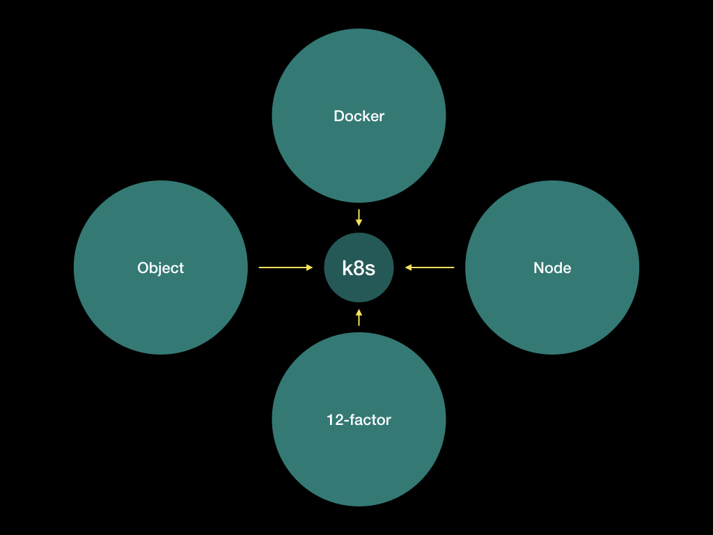
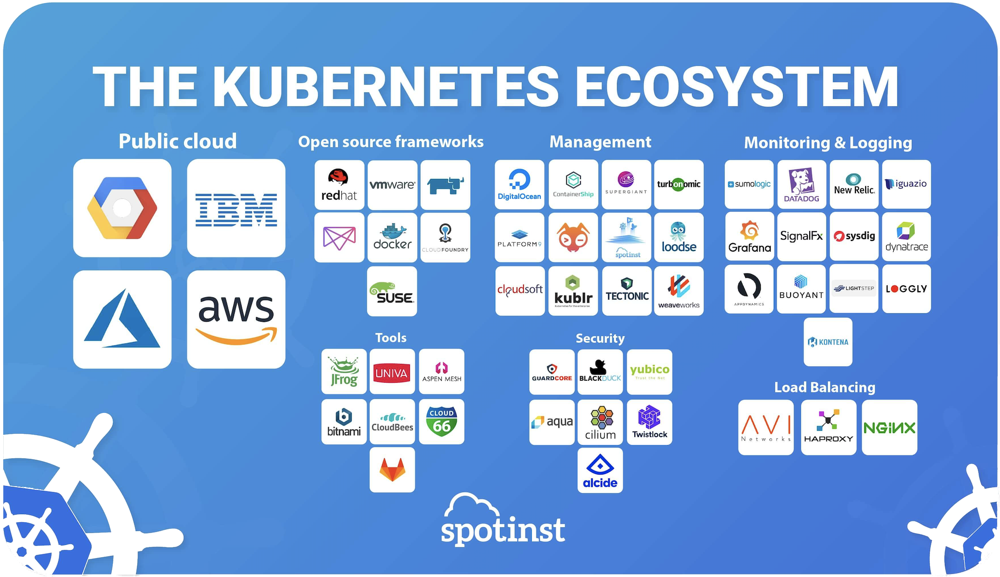
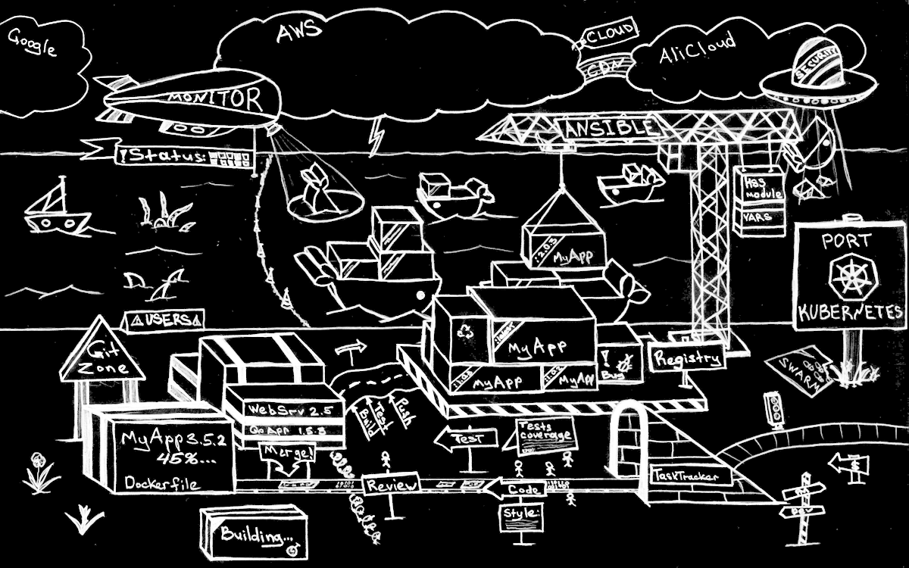
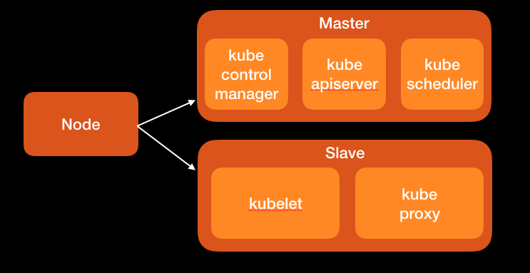
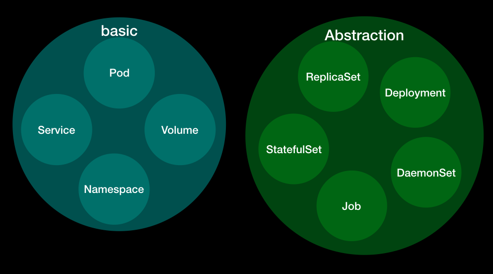
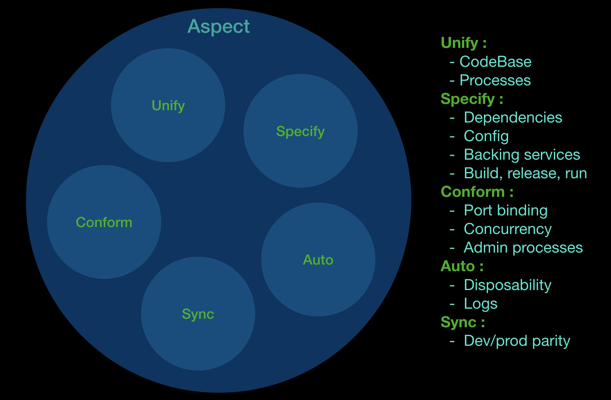

# [Day30] k8s總結：架構整合、圖表整理

Author: Nick Zhuang
Type: kubernetes

# 前言

今天我們來詳細回顧一下之前的內容，整理一些圖表及架構方便記憶。

# 正片開始

這30天以為我們看過了許多k8s的相關結構，有以下四個方面：**四大面向**、**k8s架構**、**k8s與k8s之間**、**k8s延伸**

## 1. 四大面向

從最早的介紹，我們從4個不同的面向去理解k8s：

- Docker：這個部分是指k8s是基於Docker的容器管理框架，並且在一些指令的操作上面與Docker本身重疊。
    - [[Day1] 挑戰開始：k8s初探＋簡介](https://github.com/x1y2z3456/ironman/tree/master/day1)
    - [[Day2] 一日碼頭工：快速Docker複習](https://github.com/x1y2z3456/ironman/tree/master/day2)
    - [[Day4] 碼頭工的日常與舵手的逆襲：Docker與k8s常用指令集比較](https://github.com/x1y2z3456/ironman/tree/master/day4)
- Node：這個部分是從節點的觀點去觀察k8s，Node分為Master和Slave，並可以在細化下去區分，因為Node的種類不同，所以會有不同的結構。
    - [[Day5] 淺談k8s架構之一：Node是什麼？Master與Slave有何不同？](https://github.com/x1y2z3456/ironman/tree/master/day5)
- Object：這個部分是從k8s的細部架構去看，這跟基礎篇、進階篇、管理篇的內容都有關。
    - [[Day6] 淺談k8s架構之二：什麼是Object？什麼是Abstraction？有何不同？](https://github.com/x1y2z3456/ironman/tree/master/day6)
- 12-factor：這個部分是以DevOps的角度去切入，嘗試觀察k8s在其中所扮演的角色，其中的12-factor還可以分為幾個不同的面向去看
    - [[Day7] 想想我們為何而來：一個完整DevOps開發流程的十二個要素](https://github.com/x1y2z3456/ironman/tree/master/day7)

再來的部分，就是k8s詳細的結構了

## 2. k8s架構

這個部分，分為上下兩卷，上卷是minikube的相關操作，下卷是EKS的相關操作

卷（上）

- 基礎篇：
    - [[Day3] k8s的小型測試環境：minikube安裝與使用，簡易驗證yaml的正確性](https://github.com/x1y2z3456/ironman/tree/master/day3)
    - [[Day8] k8s基礎篇（一）：Pod、Label、Health check、Scaling](https://github.com/x1y2z3456/ironman/tree/master/day8)
    - [[Day9] k8s基礎篇（二）：Deployment、ReplicaSet、Service、Secrets](https://github.com/x1y2z3456/ironman/tree/master/day9)
- 進階篇：
    - [[Day10] k8s進階篇（一）：Service Discovery、ConfigMap](https://github.com/x1y2z3456/ironman/tree/master/day10)
    - [[Day11] k8s進階篇（二）：Ingress、Volume、PodPreset](https://github.com/x1y2z3456/ironman/tree/master/day11)
    - [[Day12] k8s進階篇（三）：StatefulSet、DaemonSet](https://github.com/x1y2z3456/ironman/tree/master/day12)
    - [[Day13] k8s進階篇（四）：Affinity and Anti-Affinity、Taints and Tolerations](https://github.com/x1y2z3456/ironman/tree/master/day13)
- 管理篇：
    - [[Day14] k8s管理篇（一）：Monitoring、Job、CronJob](https://github.com/x1y2z3456/ironman/tree/master/day14)
    - [[Day15] k8s管理篇（二）：Resource Quota、Namespaces](https://github.com/x1y2z3456/ironman/tree/master/day15)
    - [[Day17] k8s管理篇（三）：User Management、RBAC、Node Ｍaintenance](https://github.com/x1y2z3456/ironman/tree/master/day17)
- 應用篇：
    - [[Day16] k8s之PV小整合：Pod、Deployment、Service、Job與PersistentVolume](https://github.com/x1y2z3456/ironman/tree/master/day16)
    - [[Day18] k8s之管理篇延伸：兩個H的小故事：Harbor與Helm](https://github.com/x1y2z3456/ironman/tree/master/day18)

卷（下）

- 基礎篇：
    - [[Day19] k8s上雲端之路：AWS之蓄勢待發：EOO](https://github.com/x1y2z3456/ironman/tree/master/day19)
    - [[Day20] k8s實務篇（一）：EKS架設k8s（上）](https://github.com/x1y2z3456/ironman/tree/master/day20)
    - [[Day21] k8s實務篇（二）：EKS架設k8s（下）](https://github.com/x1y2z3456/ironman/tree/master/day21)
    - [[Day22] k8s基礎篇延伸與EKS：Pod、Label、Probe、Scaling](https://github.com/x1y2z3456/ironman/tree/master/day22)
- 進階篇：
    - [[Day23] k8s進階篇延伸與EKS（一）：Ingress、ELB、Service](https://github.com/x1y2z3456/ironman/tree/master/day23)
    - [[Day24] k8s進階篇延伸與EKS（二）：Affinity、Taint、Cordon](https://github.com/x1y2z3456/ironman/tree/master/day24)
- 管理篇：
    - [[Day25] k8s管理篇延伸與EKS（一）：Service Discovery、Dashboard、Monitoring](https://github.com/x1y2z3456/ironman/tree/master/day25)
    - [[Day26] k8s管理篇延伸與EKS（二）：Resource Quota、Namespace、RBAC](https://github.com/x1y2z3456/ironman/tree/master/day26)
- 應用篇：
    - [[Day27] k8s應用篇（一）：Helm部署apps、HPA和CA](https://github.com/x1y2z3456/ironman/tree/master/day27)
    - [[Day28] k8s應用篇（二）：EBS和EFS的使用](https://github.com/x1y2z3456/ironman/tree/master/day28)

## 3. k8s與k8s之間

這個部分是群集與集群之間溝通的內容，我們有提到集群的備援：HA、Federation

- [[Day29] k8s集群篇：HA、Federation](https://github.com/x1y2z3456/ironman/tree/master/day29)

## 4. k8s之延伸

雖然我們從剛開始到現在有介紹過很多與k8s相關的套件，避免疏漏，補個生態圖，鑑往知來。

圖片來源：[https://spotinst.com/blog/kubernetes-ecosystem/](https://spotinst.com/blog/kubernetes-ecosystem/)

可以看到主要有七大面向：

- Public cloud：公有雲，可以看到對應的廠商，像是我們有用到EKS所屬的AWS
- Open source frameworks：開源框架，像是我們提過的Docker
- Management：管理工具，像是我們有安裝過的WeaveScope就是屬於weaveworks的範疇
- Monitoring & Logging：監控與日誌，像是一般常見的搭配Prometheus使用的Grafana
- Load Balancing：負載平衡器，像是我們有用過的nginx
- Security：安全防護，像是BLACKDUCK，可以協助檢查開放原始碼的漏洞
- Tools：小工具，像是GitLab，這是Local端的git管理工具

這個部分會跟後續k8s的發展有關聯，後續這些相關面向的更新，都值得我們密切關注。

## 總結

所以從整體來看，k8s可以有多個Federation，而單個Federation可以分有多個Cluster，每個Cluster可以分為四大方面去觀察：Docker、Node、Object、12-factor，再依照這四大方面下去細分對應的項目去看，一致性的邏輯是這樣。

Docker：k8s是基於Docker的管理框架

圖片來源：[https://medium.com/@dpaunin/the-best-architecture-with-docker-and-kubernetes-myth-or-reality-77b4f8f3804d](https://medium.com/@dpaunin/the-best-architecture-with-docker-and-kubernetes-myth-or-reality-77b4f8f3804d)

Node：分為Master和Slave

Object：分為basic和Abstraction

12-factor：五大Aspect：Unify、Specify、Conform、Auto、Sync

# 小技巧

這邊歸納了一些Docker與k8s使用的小技巧

首先，安裝完後，為了方便，你可以增加些設置加速你下指令的速度

1. 設置Auto Complete
2. 參考Cheat Sheet
3. 使用一些圖像介面監控和管理

## 設置Auto Complete

可以參考：[Mac設置Docker的AutoComplete](https://blog.alexellis.io/docker-mac-bash-completion/)

或是自行Google，找這個關鍵字

## 參考Cheat Sheet

可以參考：[Docker的一些筆記](https://github.com/miendinh/docker-notes)、[k8s的Cheat Sheet與Auto Complete](https://kubernetes.io/docs/reference/kubectl/cheatsheet/)

## 圖像介面監控與管理

可以參考：Docker的Harbor（管理Private registry）、k8s的Dashboard（監控元件好用）、k8s的Helm（管理YAML）

# 心得感想

剛開始寫幾天基本上沒什麼感覺，因為有先寫了大概10篇左右，不過到後面發現根本不夠用XD，上班忙起來整個就翻掉，中途差點翻船，不外乎Debug到半夜三四點，隔天還是要上班（肝到爆，後面總算是有些多餘的時間挺過來了，還有一次忘記把EKS集群關掉，多噴了三天的摳摳，比較有挑戰的部分應是你必須要在有限的時間把Bug修掉，不然就不用發文啦哈哈，直接Say Goodbye，有想挑戰的朋友，建議先寫個20篇再來會比較穩，有機會的話，可能會再寫些別的主題看看。整體來說，這整個30篇大概歸類在入門到進階之間，如下圖：

第一次發系列文，希望這一系列的文章有幫助到需要的朋友，筆者盡量呈現整體的完整性，若有誤請見諒，程式碼可以在Github下載，謝謝大家的收看囉！

文末的參考連結已將所有架構性或是實作相關內容，筆者覺得寫得不錯的部分一併分享，感謝提供靈感，謝謝你們。

另外特別感謝同事揪團，沒有你們我也不會去寫這個XD，雖然我們團賽出了點小狀況，有機會再一起挑戰！

# 參考連結

- [k8s的設計與架構](https://github.com/kubernetes/community/blob/master/contributors/design-proposals/architecture/architecture.md)
- [k8s的發展藍圖](https://github.com/kubernetes/community/blob/master/contributors/design-proposals/architecture/architectural-roadmap.md)
- [k8s相關的生態網架構圖](https://spotinst.com/blog/kubernetes-ecosystem/)
- [EKS的workshop](https://eksworkshop.com/introduction/)
- [k8s中文指南](https://jimmysong.io/kubernetes-handbook/)
- [k8s的DIY](https://k2r2bai.com/tags/Kubernetes/)
- [k8s官方文檔](https://kubernetes.io/docs/home/)
- [k8s的30天筆記](https://ithelp.ithome.com.tw/users/20103753/ironman/1590?page=1)

最後一天了，很開心有寫滿完整的30天，我想分享一句話：

生命的痕跡，來自於靈魂的永恆淬煉。

The trace of life is from the eternal quenching of soul.

各位看官，我是尼克，我們有緣再見。