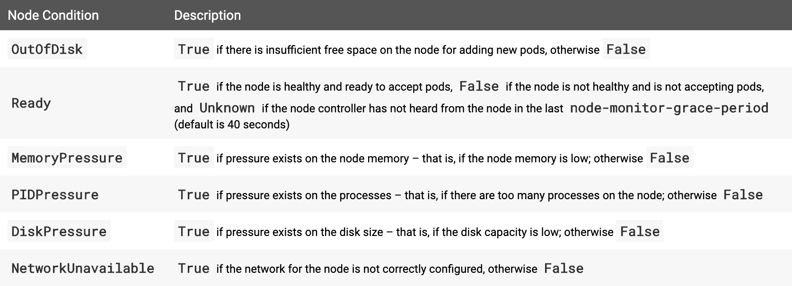

# [Day5] 淺談k8s架構之一：Node是什麼？Master與Slave有何不同？

Author: Nick Zhuang
Type: kubernetes

# 前言

今天我們來談一下關於k8s的架構，這個觀點是從節點的角度去觀察的，也就是Node，當然早在前面我們有先提過一些，[小複習：k8s的基礎架構](https://github.com/x1y2z3456/ironman/blob/master/day1/README.md)，在這個章節，我們來詳細說下Node的架構。

# Node是什麼？

節點是k8s中的工作機器，以前稱為minion。節點可以是VM或物理機，具體取決於集群。每個節點都包含運行pod所需的服務，並由主節點組件管理。節點上服務包括了容器運行時的kubelet和kube-proxy。

# Node的狀態

節點有以下4個狀態：

- Addresses（地址）
- Conditon（節點狀態）
- Capacity and Allocatable（容量和可分配量）
- Info（詳細資訊）

我們來詳細看一下

## 地址

有三種定義方式：

- HostName（本機名稱）: 節點內核報告的主機名
- ExternalIP（外部IP）: 可從外部連線的節點的IP地址（可從群集外部獲得）。
- InternalIP（內網IP）: 僅在群集內可連線的節點的IP地址。

## 節點狀態

## 容量和可分配量

描述節點上可用的資源：CPU，記憶體以及可以在節點上調度的最大pod數

## 詳細資訊

描述有關節點的一般信息，例如內核版本，k8s版本（kubelet和kube-proxy版本），Docker版本（如果有用的話）和操作系統名稱。此信息由Kubelet從節點收集。

我們看個例子比較清楚，簡單理解就是如果狀態不是Ready就是節點有問題

還記得我們架設的minikube嗎？我們來看看他的狀態吧！

    $kubectl get no
    NAME       STATUS   ROLES    AGE    VERSION
    minikube   Ready    master   171d   v1.13.4

關於minikube詳細的節點訊息:

    $kubectl describe no minikube
    Name:               minikube
    Roles:              master
    Labels:             beta.kubernetes.io/arch=amd64
                        beta.kubernetes.io/os=linux
                        hardware=high-spec
                        kubernetes.io/hostname=minikube
                        node-role.kubernetes.io/master=
    Annotations:        kubeadm.alpha.kubernetes.io/cri-socket: /var/run/dockershim.sock
                        node.alpha.kubernetes.io/ttl: 0
                        volumes.kubernetes.io/controller-managed-attach-detach: true
    CreationTimestamp:  Thu, 21 Mar 2019 00:24:19 +0800
    Taints:             <none>
    Unschedulable:      false
    Conditions:
      Type             Status  LastHeartbeatTime                 LastTransitionTime                Reason                       Message
      ----             ------  -----------------                 ------------------                ------                       -------
      MemoryPressure   False   Sun, 08 Sep 2019 22:20:55 +0800   Thu, 21 Mar 2019 00:24:08 +0800   KubeletHasSufficientMemory   kubelet has sufficient memory available
      DiskPressure     False   Sun, 08 Sep 2019 22:20:55 +0800   Thu, 21 Mar 2019 00:24:08 +0800   KubeletHasNoDiskPressure     kubelet has no disk pressure
      PIDPressure      False   Sun, 08 Sep 2019 22:20:55 +0800   Thu, 21 Mar 2019 00:24:08 +0800   KubeletHasSufficientPID      kubelet has sufficient PID available
      Ready            True    Sun, 08 Sep 2019 22:20:55 +0800   Thu, 21 Mar 2019 00:24:08 +0800   KubeletReady                 kubelet is posting ready status
    Addresses:
      InternalIP:  10.0.2.15
      Hostname:    minikube
    Capacity:
     cpu:                2
     ephemeral-storage:  16888216Ki
     hugepages-2Mi:      0
     memory:             2038624Ki
     pods:               110
    Allocatable:
     cpu:                2
     ephemeral-storage:  15564179840
     hugepages-2Mi:      0
     memory:             1936224Ki
     pods:               110
    System Info:
     Machine ID:                 d01d0dc5fe7c454d8961d95d66b3d1bb
     System UUID:                AF704AB3-A7BB-47C7-9138-D4C41EE32C87
     Boot ID:                    bcd8de88-0b91-4a0b-a7ad-5d5bf0dcc873
     Kernel Version:             4.15.0
     OS Image:                   Buildroot 2018.05
     Operating System:           linux
     Architecture:               amd64
     Container Runtime Version:  docker://18.6.2
     Kubelet Version:            v1.13.4
     Kube-Proxy Version:         v1.13.4
    Non-terminated Pods:         (10 in total)
      Namespace                  Name                                CPU Requests  CPU Limits  Memory Requests  Memory Limits  AGE
      ---------                  ----                                ------------  ----------  ---------------  -------------  ---
      default                    nodehelloworld.example.com          0 (0%)        0 (0%)      0 (0%)           0 (0%)         3h
      kube-system                coredns-86c58d9df4-8lg4n            100m (5%)     0 (0%)      70Mi (3%)        170Mi (8%)     171d
      kube-system                coredns-86c58d9df4-wwmwl            100m (5%)     0 (0%)      70Mi (3%)        170Mi (8%)     171d
      kube-system                etcd-minikube                       0 (0%)        0 (0%)      0 (0%)           0 (0%)         171d
      kube-system                kube-addon-manager-minikube         5m (0%)       0 (0%)      50Mi (2%)        0 (0%)         171d
      kube-system                kube-apiserver-minikube             250m (12%)    0 (0%)      0 (0%)           0 (0%)         171d
      kube-system                kube-controller-manager-minikube    200m (10%)    0 (0%)      0 (0%)           0 (0%)         170d
      kube-system                kube-proxy-h9wtj                    0 (0%)        0 (0%)      0 (0%)           0 (0%)         171d
      kube-system                kube-scheduler-minikube             100m (5%)     0 (0%)      0 (0%)           0 (0%)         171d
      kube-system                storage-provisioner                 0 (0%)        0 (0%)      0 (0%)           0 (0%)         171d
    Allocated resources:
      (Total limits may be over 100 percent, i.e., overcommitted.)
      Resource           Requests     Limits
      --------           --------     ------
      cpu                755m (37%)   0 (0%)
      memory             190Mi (10%)  340Mi (17%)
      ephemeral-storage  0 (0%)       0 (0%)
    Events:              <none>

### 注意到其中的幾個重點：

### 容量和可分配量

    Capacity:
     cpu:                2
     ephemeral-storage:  16888216Ki
     hugepages-2Mi:      0
     memory:             2038624Ki
     pods:               110
    Allocatable:
     cpu:                2
     ephemeral-storage:  15564179840
     hugepages-2Mi:      0
     memory:             1936224Ki
     pods:               110

值得注意的是，其中有個訊息叫做**ephemeral-storage**，這個參數是限制容量用的，後面管理篇會介紹

### 詳細資訊

    System Info:
     Machine ID:                 d01d0dc5fe7c454d8961d95d66b3d1bb
     System UUID:                AF704AB3-A7BB-47C7-9138-D4C41EE32C87
     Boot ID:                    bcd8de88-0b91-4a0b-a7ad-5d5bf0dcc873
     Kernel Version:             4.15.0
     OS Image:                   Buildroot 2018.05
     Operating System:           linux
     Architecture:               amd64
     Container Runtime Version:  docker://18.6.2
     Kubelet Version:            v1.13.4
     Kube-Proxy Version:         v1.13.4

# Node管理初體驗

試著在minikube的群集加一個節點

    $vim add-node.yaml
    {
      "kind": "Node",
      "apiVersion": "v1",
      "metadata": {
        "name": "192.168.10.2",
        "labels": {
          "name": "my-first-k8s-node"
        }
      }
    }

用kubectl增加節點，除了用apply外，也可以用create，不過要注意兩者是有差別的，參考：[kubectl中apply和create的差別](https://stackoverflow.com/questions/47369351/kubectl-apply-vs-kubectl-create)

    $kubectl apply -f add-node.yaml
    node/192.168.10.2 created

檢查node狀態

    $kubectl get no
    NAME           STATUS    ROLES    AGE    VERSION
    192.168.10.2   Unknown   <none>   42s
    minikube       Ready     master   171d   v1.13.4

過一陣子狀態會變為

    $kubectl get no
    NAME           STATUS     ROLES    AGE     VERSION
    192.168.10.2   NotReady   <none>   4m26s
    minikube       Ready      master   171d    v1.13.4

檢查它的詳細狀態

    $kubectl describe no 192.168.10.2
    Name:               192.168.10.2
    Roles:              <none>
    Labels:             name=my-first-k8s-node
    Annotations:        kubectl.kubernetes.io/last-applied-configuration:
                          {"apiVersion":"v1","kind":"Node","metadata":{"annotations":{},"labels":{"name":"my-first-k8s-node"},"name":"192.168.10.2"}}
                        node.alpha.kubernetes.io/ttl: 0
    CreationTimestamp:  Sun, 08 Sep 2019 22:47:02 +0800
    Taints:             node.kubernetes.io/unreachable:NoExecute
                        node.kubernetes.io/unreachable:NoSchedule
    Unschedulable:      false
    Conditions:
      Type             Status    LastHeartbeatTime                 LastTransitionTime                Reason                   Message
      ----             ------    -----------------                 ------------------                ------                   -------
      Ready            Unknown   Sun, 08 Sep 2019 22:47:02 +0800   Sun, 08 Sep 2019 22:48:04 +0800   NodeStatusNeverUpdated   Kubelet never posted node status.
      OutOfDisk        Unknown   Sun, 08 Sep 2019 22:47:02 +0800   Sun, 08 Sep 2019 22:48:04 +0800   NodeStatusNeverUpdated   Kubelet never posted node status.
      MemoryPressure   Unknown   Sun, 08 Sep 2019 22:47:02 +0800   Sun, 08 Sep 2019 22:48:04 +0800   NodeStatusNeverUpdated   Kubelet never posted node status.
      DiskPressure     Unknown   Sun, 08 Sep 2019 22:47:02 +0800   Sun, 08 Sep 2019 22:48:04 +0800   NodeStatusNeverUpdated   Kubelet never posted node status.
      PIDPressure      Unknown   Sun, 08 Sep 2019 22:47:02 +0800   Sun, 08 Sep 2019 22:48:04 +0800   NodeStatusNeverUpdated   Kubelet never posted node status.
    Addresses:
    System Info:
     Machine ID:
     System UUID:
     Boot ID:
     Kernel Version:
     OS Image:
     Operating System:
     Architecture:
     Container Runtime Version:
     Kubelet Version:
     Kube-Proxy Version:
    Non-terminated Pods:         (0 in total)
      Namespace                  Name    CPU Requests  CPU Limits  Memory Requests  Memory Limits  AGE
      ---------                  ----    ------------  ----------  ---------------  -------------  ---
    Allocated resources:
      (Total limits may be over 100 percent, i.e., overcommitted.)
      Resource           Requests  Limits
      --------           --------  ------
      cpu                0 (0%)    0 (0%)
      memory             0 (0%)    0 (0%)
      ephemeral-storage  0 (0%)    0 (0%)
    Events:              <none>

通常這樣的狀態是設置不全造成的，因為我們區網內並沒有這台機器，所以這種情況我們應該先暫時將它不列入排程中

將該節點從排程移除

    $kubectl cordon 192.168.10.2
    node/192.168.10.2 cordoned

我們來看看現在群集的所有節點狀態

    $kubectl get no
    NAME           STATUS                        ROLES    AGE    VERSION
    192.168.10.2   NotReady,SchedulingDisabled   <none>   10m
    minikube       Ready                         master   171d   v1.13.4

接著若機器設置妥當，我們就可以將它重新加入排程

    $kubectl uncordon 192.168.10.2
    node/192.168.10.2 uncordoned

反之，若是要棄用該節點的話，我們可以這麼做

    $kubectl delete -f add-node.yaml
    node "192.168.10.2" deleted

這邊我們其實也可以用kubectl delete no 192.168.10.2去刪除它，這種情況下是沒有差別的，不過在某些情況下，前者的方式是比較好的，因為YAML定義了整個架構，刪除的時候會把全部相關的一起刪掉，後面管理篇會詳細介紹。

# 小結

今天我們理解了什麼是節點，並詳加介紹了它本身的特性及操作方式，關於節點其實還有些更細緻的操作，不過截至目前為止我們已經知道它是跟群集比較接近的範疇，部署好後大多的情況是不太需要更動的，除非是定期維護的時候就另當別論，當然這邊為了區分方便，我們就把Node稱作Slave，這是為了和主節點區分，也就是Master，避免混淆，我們來看張架構圖：

### Ｍaster是由etcd、kube-controller manager、kube-apiserver、kubescheduler構成

### Slave是由kubelet、kube-proxy構成

其中在群集與Master的溝通是以apiserver作為通信的，當apiserver需要獲得Slave的資訊時，它會向Slave上的kubelet詢問。

這個cloud是指雲端，雲端上的k8s建置會用到CCM（Cloud Controller Manager），這個部分會在後續k8s架設在雲端的實作部分作（EKS）介紹。敬請期待！我們明天見！！

# 參考資料

- [節點概述](https://kubernetes.io/docs/concepts/architecture/nodes/)
- [主節點通信機制](https://kubernetes.io/docs/concepts/architecture/master-node-communication/)
- [雲端運算管理器（CCM）](https://kubernetes.io/docs/concepts/architecture/cloud-controller/)

